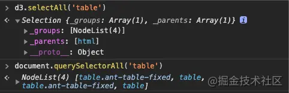

1. D3-selection：主要是用来进行选择元素，设置属性、数据绑定，事件绑定等操作。
   1. d3.select()：返回目标元素的第一个节点，
   2. d3.selectAll()：返回目标元素的集合
   3. d3.select 返回的是一个 selection 对象，querySelector 返回的是一个 NodeList 数组。通过控制台打印的信息，可以看到 selection 下的 groups 存放了所有选择的元素集合，parents 存放了所有选中元素的父节点。
      

2. 数据绑定思想，有三种模式
   1. update：已经和data数据绑定的DOM元素集合
   2. enter：data数据没有找到与之对应的DOM元素集合（就是缺失的DOM元素）
   3. exit：没有被数据绑定的DOM元素集合（多余的DOM元素）

3. 比例尺：d3有各种各样的比例尺来满足不同的需求