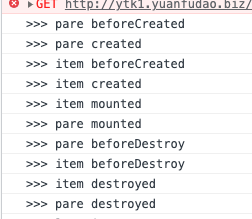

1. 代码解析

        ```
        new Vue({
            template: "<div id='xixixixixi'></div>"
            // render: h => h(App)
        }).$mount('#app');
        ```

    1. 新建一个vue项目，第一个new Vue后边的$mount('#app')，里边一定是#app，因为vue在使用时，它会默认创建一个<div id='app'></div>，你将里边改成别的id，在页面审查元素的时候，也只能看见一个<div id='app'></div>，你里边如果不是#app，那这个vue就无效了
    2. template里边的代码会覆盖#app里边的代码，当如上边代码一样设置的时候，就看不到<div id='app'></div>，而是会看到<div id='xixixixixi'></div>
    3. render函数存在是，template就会失效，vue就会渲染 render函数里边的模板

2. vue inspect:因为@vue/cli-service 对 webpack 配置进行了抽象，所以理解配置中包含的东西会比较困难，尤其是当你打算自行对其调整的时候。vue-cli-service 暴露了 inspect 命令用于审查解析好的 webpack 配置。那个全局的 vue 可执行程序同样提供了 inspect 命令，这个命令只是简单的把 vue-cli-service inspect 代理到了你的项目中。(简单来说，使用vue inpect 可以查看webpack.config.js)

      * vue inpect >> 文件名：将webpack配置输出到一个文件当中，一个> 和>>区别见shell常用指令

3. vue中动态引入图片时必须要用require，否则vue会把src里边的地址解析为字符串

    ```
     // 正常加载

     // 动态地址，路径被加载器解析为字符串，图片找不到
    ```
    ```
    src1：require('../img/image1.jpg'),

    src2：require('../img/image2.jpg'),

    index: 1,
    ```
    ```
     // 动态地址，正常加载
    ```
    网上还有一种说法就是，图片的地址需要放到js当中，所以在vue里使用时，需要使用require，意思是一样的。

4. #号的作用
    1.  #代表网页中的一个位置。其右面的字符，就是该位置的标识符

        ```
        http://www.example.com/index.html#print
        ```
        就代表网页index.html的print位置。浏览器读取这个URL后，会自动将print位置滚动至可视区域。

        为网页位置指定标识符，有两个方法。一是使用锚点，比如\<a name="print"></a>，二是使用id属性，比如\<div id="print" >。

    2.  #是用来指导浏览器动作的，对服务器端完全无用。所以，HTTP请求中不包括#。

        ```
        http://www.example.com/index.html#print

        浏览器实际发出的请求是这`样的：

        GET /index.html HTTP/1.1

        Host: www.example.com`
        ```
    3. 单单改变#后的部分，浏览器只会滚动到相应位置，不会重新加载网页。
    4. 每一次改变#后的部分，都会在浏览器的访问历史中增加一个记录，使用"后退"按钮，就可以回到上一个位置。
    5. window.location.hash读取#值:window.location.hash这个属性可读可写。读取时，可以用来判断网页状态是否改变；写入时，则会在不重载网页的前提下，创造一条访问历史记录。
    6. onhashchange事件:这是一个HTML 5新增的事件，当#值发生变化时，就会触发这个事件.对于不支持onhashchange的浏览器，可以用setInterval监控location.hash的变化。

5. 单页面应用：
    1.  定义：就是仅在页面初始化的时候加载相应的html/css/js一单页面加载完成,不会因为用户的操作而进行页面的重新加载或者跳转,用javascript动态的变化html的内容
    2.  优点：
        1.  优点：用户操作体验好，用户不用刷新页面，整个交互过程都是通过Ajax来操作。
        2.  适合前后端分离开发，服务端提供http接口，前端请求http接口获取数据，使用JS进行客户端渲染。
    3.  缺点：
        1.  首页加载慢
        2.  SEO不友好

6. history与hash：
    1.  [实现原理](https://www.jianshu.com/p/6394a29495c6)
    2.  比较：
        1.  hash —— 即地址栏 URL 中的 # 符号（此 hash 不是密码学里的散列运算）。比如这个 URL：http://www.abc.com/#/hello，hash 的值为 #/hello。它的特点在于：hash 虽然出现在 URL 中，但不会被包括在 HTTP 请求中，对后端完全没有影响，因此改变 hash 不会重新加载页面。
        2.  history —— 利用了 HTML5 History Interface 中新增的 pushState() 和 replaceState() 方法。（需要特定浏览器支持）这两个方法应用于浏览器的历史记录栈，在当前已有的 back、forward、go 的基础之上，它们提供了对历史记录进行修改的功能。只是当它们执行修改时，虽然改变了当前的 URL，但浏览器不会立即向后端发送请求。
    3.  比较：history存在一个问题，对于单页应用来讲，理想的使用场景是仅在进入应用时加载index.html，后续操作通过ajax来完成，不会根据 URL 重新请求页面，但是难免遇到特殊情况，比如用户直接在地址栏中输入并回车，浏览器刷新或者重启
    hash模式仅改变hash部分的内容，而hash部分是不会包含在HTTP请求中的：

        ```
        http://oursite.com/#/user/id   // 如重新请求只会发送http://oursite.com/
        ```
        所以在hash模式下，当 URL 改变时，页面不会重新加载
        而在history模式下，URL 就是正常的 URL（建议：前端路由 URL 和后端保持一致）

        ```
        http://oursite.com/user/id
        ```

        在此情况下重新（刷新F5）向后端发送请求，如后端没有配置对应/user/id的路由处理，则会返回404错误。

    1.  hash模式，path加到#/后边?前边
7. 在vue + ts开发中
   1.  在src文件夹里边添加shims-vue.d.ts文件，内容为

     ```
     declare module '*.vue' {
       import Vue from 'vue'
       export default Vue
     }
     ```
     如果不加这个文件，在TS文件中是识别不了.vue结尾的文件的，也就是说即使你加了.vue它也会报错，不过只是TS报错，说不能识别Vue，但是不影响编译
   2.  ts文件里边import vue文件，**后缀名不能省略**，是因为TS只会默认检测.js 和 .ts结尾的文件，所以不加.vue是识别不了的，没加的话，他会先找js，再找ts，不会去找vue
8.  在使用vue-property-decorator时，每个组件的class上边必须使用@Component，否则无法识别它是一个组件，则无法使用
9.  使用vue.config.js里边的proxy配置时，请求别人的ip时，记得加上http://这个东西，没有协议使用不了
10. vue.config.js 更改之后需要重新npm run serve才会神效
11. 单页面应用的时候，因为只有一个页面，所以 域名/#/ + 路由，在多页面应用当值，域名/对应页面.html#/ + 路由信息，举例：

        ```
        xyks.yuanfudao.biz/parent-tash.html#/ + 该页面下的路由信息
        ```

12. axios设置了withCredentials为true，但是仍然不携带cookie的问题：key
    * 原因：在Chrome86版本开始，即使域名相同，但是协议不同也会作为跨站的判断因素，如果站点之间https协议和http协议混存，那么需要注意这个问题。
    * 解决方法：chrome://flags/#schemeful-same-site，进入这个页面，将Schemeful Same-Site禁掉就可以解决这个问题
    * **上边方法已经失效了**
    * 新方法，
      * https://github.com/RubenVermeulen/generate-trusted-ssl-certificate 使用这个生成证书
      * 然后在chrome-设置-安全-添加证书，https://blog.csdn.net/weixin_41948075/article/details/91564743
      * 然后更改config里边的devserver，添加https，https://www.jianshu.com/p/dabe3c249f3e
    * 方法二
      * open -n /Applications/Google\ Chrome.app/ --args --disable-web-security  --user-data-dir=/Users/自己的名字/Documents/chromecors --disable-features=SameSiteByDefaultCookies
      * 使用上边的指令打开一个新的chrome页面，然后在新的页面里打开网页，原理和失效的那个方法一样，只不过chrome里边已经找不到这个选项了，但是指令还是可以执行的。
    * [cookie的same-site](https://juejin.cn/post/6844904095711494151)

13. 插槽的用法更新了
14. vue.config.js里边配置devServer的proxy，说是更改了host，但是在chrome中是看不到host改变的，后台那边收到的host才可以看见是代理后的url
15. axios，如果请求的url里边加上http://，那么请求的路径就不会拼接本地路径，如果不加就会拼接

16. $nextTick
    * 情况分为两种：

            const app = new Vue({
                el: '#app',
                data() {
                  return {
                    count: 0,
                    count2: 0
                  }
                },
                mounted() {
                  this.count++
                  Promise.resolve().then(() => {
                    console.log('Promise');
                    console.log(document.getElementById('p1').innerHTML);
                  })
                  console.log(document.getElementById('p1').innerHTML);
                  this.$nextTick(() => {
                    console.log('nextTick');
                    console.log(document.getElementById('p1').innerHTML);
                  })
                }
              })

        + 第一种是有this.count++的时候，这时候输出的顺序是：

                nextTick
                Promise

            这是因为在count更改的时候，vue内部已经执行过一次nextTick函数，把callbacks队列已经推入到微任务当中，此时再使用$nextTick就是向callbacks中添加任务，他总是会在下一个微任务之前执行，也就是在我们声明的Promise.then()之前执行，这个代码的执行顺序是：

                this.count++
                callbacks推入微任务队列
                Promise.then()推入微任务队列
                $nextTick执行，并向callback中添加我们要执行的函数

        + 第二种，没有this.count++时，这时候就不会把callbacks推入到微任务队列当中，所以执行顺讯就变为：

                Promise.then()推入微任务队列
                $nextTick执行，并把callback推入微任务队列

            所以输出的就是Promise -> nextTick

        + 结合这两种情况，我们就可以判断先后顺序了，还有一种情况，假如this.count++在this.$nextTick后边执行的话，那么输出也是Promise -> nextTick，这是因为，根据流程Promise.then()这个微任务在callbacks之前就注册了

17. 为什么vue必须要有根节点
    * 因为在diff里边是单节点操作，而不是数组操作，所以必须有一个根节点

18. vue3为什么用proxy代替defineProperty
    * defineProperty:
        - 无法监听数组变化
        - 只能劫持对象的属性,因此我们需要对每个对象的每个属性进行遍历，如果属性值也是对象那么需要深度遍历
        - 兼容性好
    * proxy:
        - 可以直接监听对象而非属性，所以不必遍历监听属性
        - Proxy可以直接监听数组的变化
        - 作为新标准将受到浏览器厂商重点持续的性能优化，也就是传说中的新标准的性能红利
        - 不兼容IE，是 ES6 为了操作对象而提供的新 API


19. diff算法
20. vue 事件总线
    * 总的来说就是发布者订阅者模式，new vue作为消息中心，然后兄弟组件中去订阅事件，通过这种方式来兄弟组件之间传参

21. computed和watch的比较
    * 相同点：他们两个都是去实现一种机制，就是当被依赖数据发生改变的时候，依赖数据会根据我们定义好的function去自动发生改变的一种机制
    * 不同点：
        - 擅长处理场景的不同：
            + computed：擅长处理一个数据受到多个数据影响的情景
            + watch：擅长处理一个数据影响多个数据的场景
        - 机制的不同：
            + computed拥有缓存机制，即在页面需要重新渲染的时候，如果被依赖数据没有发生改变，那么就会使用上次缓存的结果，而不会执行我们定义的函数
            + computed不支持异步操作，如果在computed里边使用异步操作的话，将无法监听数据的变化
            + watch没有缓存机制，每一次都会重新执行我们定义的函数
            + watch支持异步操作
        - 参数问题：
            + computed没有参数
            + watch允许有两个参数newVal和oldVal
    * watch使用的时候，还有两点需要注意
        - watch在绑定的时候不会立即执行，而是会等到监听的数据发生改变的时候才会执行，如果想要立即执行的话，则需要将immediate属性设置为true
        - 还有就是在监听复杂数据的时候，有时候需要监听变量的内部情况，需要将deep属性设置为true进行深度监听

                watch: {
                    a: {
                        handler(newVal, oldVal) {
                            // 函数
                        },
                        immediate:true,
                        deep: true
                    }
                }

                computed: {
                    fullName() {
                        return this.firstName + this.lastName
                    }
                }

22. vue.config.js里边配置devServer的proxy，说是更改了host，但是在chrome中是看不到host改变的，后台那边收到的host才可以看见是代理后的url
23. axios，如果请求的url里边加上http://，那么请求的路径就不会拼接本地路径，如果不加就会拼接
24. vue + ts 监听路由变化

        ```
        @Watch('$route', { immediate: true })
        routeWatch(route: any) {
            console.log('>>>', 'route', route)
        }
        ```
    注意：{ immediate: true }这句话很关键
25. [vue 区分不同的环境](https://juejin.cn/post/6844903839590531079)，通过--mode来实现，配置 /.env.我们定义的环境名字/，里边配置
     1.   NODE_ENV：production和development
     2.   自己定义其他的变量也可以，上边那个变量也不是一定的，是社区约定的
     3.   使用：vue-cli-service build --mode 我们定义的环境名字
     4.   当直接调用vue-cli-service build，没有设置--mode时，默认值时development
     5.   NODE_ENV属性值 一般只有 production/test/development 三种值（没有在.env.[mode]文件中配置该值的前提下）,如果在 .env.[mode] 文件中设置了 NODE_ENV值，则覆盖production对应production、test对应test、其他默认都是development
26. underscore安装后不能使用，https://blog.csdn.net/qq_40314318/article/details/114284280，要在文件里边声明一下
27. [.sync](https://www.jianshu.com/p/6b062af8cf01)
28. vue先渲染父组件再渲染子组件
29. v-if，v-show，display:none与visibility:hidden
    1.  v-if 是在**DOM中**生成或者移除一个元素，就是DOM里边直接没有这个元素
    2.  display:none是DOM里边有，但是被隐藏了，并且不占据空间，重排和重绘
    3.  visibility:hidden是，被隐藏了，DOM里也有，但是要占据空间，只是重绘不会重排
    4.  v-show就是使用disply:none来隐藏元素
30. position:absolute/fixed存在时，float不起作用
31. 当引入keep-alive的时候，页面第一次进入，钩子的触发顺序created-> mounted-> activated，退出时触发deactivated。当再次进入（前进或者后退）时，只触发activated。
32. computed与watch区别：watch和computed很相似，watch用于观察和监听页面上的vue实例，当然在大部分情况下我们都会使用computed，但如果要在数据变化的同时**进行异步操作或者是比较大的开销**，那么watch为最佳选择。
33. computed与method区别：method只要调用就会重新执行一次，而computed有缓存，只要依赖的数据没有变化会立即返回之前的计算结果，而不必再次执行函数。
34. [vue与react的区别](https://www.zhihu.com/question/309891718/answer/1066629375)
     1.   Vue跟React的最大区别在于数据的reactivity，就是反应式系统上。**Vue提供反应式的数据，当数据改动时，界面就会自动更新，而React里面需要调用方法SetState**。我把两者分别称为Push-based和Pull-based。所谓Push-based就是说，改动数据之后，数据本身会把这个改动推送出去，告知渲染系统自动进行渲染。在React里面，它是一个Pull的形式，用户要给系统一个明确的信号说明现在需要重新渲染了，这个系统才会重新渲染。两者并没有绝对的优劣之分，更多的也是思维模式和开发习惯的不同。
35.  [MVC MVVM MVP](http://www.ruanyifeng.com/blog/2015/02/mvcmvp_mvvm.html)，[第二篇](https://juejin.cn/post/6844903480126078989)
     1.   MVC
          1.   view层是用户看见的层，用户在这边进行操作，然后将事件发送给controller
          2.   controller在事件触发后执行业务逻辑，然后根据逻辑更改model中的数据
          3.   view通过观察者模式，事先在model中进行注册，然后观察model，model发生改变，view视图更新
          4.   缺点
               1.   业务逻辑主要集中在controller，这层会变得十分臃肿
               2.   view与controller一般是一一对应的，捆绑起来形成一个组件，二者高度耦合不利于复用
     2.   MVP：Presenter作为View和Model之间的“中间人”，除了基本的业务逻辑外，还有大量代码需要对从View到Model和从Model到View的数据进行“手动同步”，这样Presenter显得很重，维护起来会比较困难。而且由于没有数据绑定，如果Presenter对视图渲染的需求增多，它不得不过多关注特定的视图，一旦视图需求发生改变，Presenter也需要改动。
     3.   MVVM：MVVM把View和Model的同步逻辑自动化了。以前Presenter负责的View和Model同步不再手动地进行操作，而是交给框架所提供的数据绑定功能进行负责，只需要告诉它View显示的数据对应的是Model哪一部分即可。
          1.   三层
               1.   『View』：视图层（UI 用户界面）
               2.   『ViewModel』：业务逻辑层（一切 js 可视为业务逻辑）
               3.   『Model』：数据层（存储数据及对数据的处理如增删改查）
          2.   Model层为数据层，仅仅关注数据本身，不关心任何行为，格式化数据由view层负责，这里可以把它理解为一个类似于json的对象
          3.   View通过使用模板语法来声明式的将数据渲染进DOM，当ViewModel对Model进行更新的时候，会通过数据绑定更新到View。
          4.   ViewModel大致上就是MVC的Controller和MVP的Presenter了，也是整个模式的重点，业务逻辑也主要集中在这里，**其中的一大核心就是数据绑定**，View的变动，自动反映在 ViewModel，
          5.   **与MVP的区别：**没有了View为Presente提供的接口，之前由Presenter负责的View和Model之间的数据同步交给了ViewModel中的数据绑定进行处理，当Model发生变化，ViewModel就会自动更新；ViewModel变化，Model也会更新。
          6.   **在MVVM中，View不知道Model的存在，ViewModel和Model也察觉不到View，这种低耦合模式可以使开发过程更加容易，提高应用的可重用性。**
          7.   简述
               1.   在 MVVM 架构下，View 和 Model 之间并没有直接的联系，而是通过 ViewModel 进行交互，Model 和 ViewModel 之间的交互是双向的， 因此 View 数据的变化会同步到 Model 中，而 Model 数据的变化也会立即反应到 View 上。
               2.   ViewModel 通过双向数据绑定把 View 层和 Model 层连接了起来，而View 和 Model 之间的同步工作完全是自动的，无需人为干涉，因此开发者只需关注业务逻辑，不需要手动操作DOM, 不需要关注数据状态的同步问题，复杂的数据状态维护完全由 MVVM 来统一管理。
36. vue 路由懒加载：不同路由对应的组件分割成不同的代码块，然后当路由被访问的时候才加载对应组件

        ```
        魔法注释，来给对应的chunk命名
        const Foo = () => import(/* webpackChunkName: "group-foo" */ './Foo.vue')
        ```

37. vue 在使用路由懒加载时，如果使用了babel，需要添加 syntax-dynamic-import 插件，babel才能正确的解析
38. 最好所有的数据请求都放在created里边
39. nextTick
    1.  Vue 会根据当前浏览器环境优先使用原生的 Promise.then 和 MutationObserver，如果都不支持，就会采用 setTimeout 代替，目的是 延迟函数到 DOM 更新后再使用
40. **使用计算属性，或者说使用某对象的属性时，使用&&先判断数据是否存在，然后再取数据**
41. 想要在vue的html中使用枚举

        ```
        enum PRIVILEDGEINDEX {
        '题目精讲',
        '知识点讲解',
        '试卷讲解',
        '试卷下载',
        '试卷还原',
        '错题整理',
        'VIP标识',
        'VIP客服',
        }

        @Component
        export default class VipIntroductionNew extends Vue {
            priviledgeIndex: any = PRIVILEDGEINDEX
        }
        ```

42. Vue的特点和优势
    1.  vue两大特点：响应式编程、组件化。
    2.  vue的优势：轻量级框架、简单易学、双向数据绑定、组件化、数据和结构的分离、虚拟DOM、运行速度快。
    3.  vue是单页面应用，使页面局部刷新，不用每次跳转页面都要请求所有数据和dom，这样大大加快了访问速度和提升用户体验。而且他的第三方ui库很多节省开发时间。
43. [vue无法监听哪些东西的响应式](https://www.cnblogs.com/sue7/p/11088696.html)
44. [vue2如何实现数组响应式](https://www.jianshu.com/p/6d90b515773a)
45. 父子组件钩子函数的执行顺序

    
    子组件的beforeUpdate与updated不会影响父组件的这两个钩子函数，父组件的也不会影响子组件的

46. 给图片添加占位符总结
    1.  原理
        1.  因为服务端传给我们的是服务器中的图片的url，当我们拿到url复制给img的src时，浏览器向这个url发送一个请求，拿到这个图片，然后放到这个位置
        2.  占位符就是在浏览器向服务端请求的过程中，我们展示我们本地的assets中的图片
        3.  然后监听图片的load事件，load触发之后，让占位符消失
    2.  遇见的问题
        1.  load事件不触发：这个就涉及到了前段时间学的东西，缓存，因为我们每次拿到的url是一样的，浏览器第一次拿到这个url的时候会发送请求，并将请求的内容缓存，第二次碰见相同的url，则会先查询memory cache然后再找disk cache，然后才会发请求，load不触发就是因为浏览器从缓存中找到了，所以不触发
47. vue inspect: **查看的是与vue.config.js合并之后的webpack配置**，不是项目默认的通用配置
48. [vue.config.js](https://juejin.cn/post/6886698055685373965)
49. [scoped](https://juejin.cn/post/6991354556349153293):每个 Vue 文件都将对应一个唯一的 id，该 id 根据文件路径名和内容 hash 生成，通过组合形成scopeId。编译 template 标签时，会为每个标签添加了当前组件的scopeId,编译 style 标签时，会根据当前组件的 scopeId 通过属性选择器和组合选择器输出样式
50. [Vue.extend](https://www.cnblogs.com/hentai-miao/p/10271652.html)
51. [axios拦截器原理](https://juejin.cn/post/6844904039608500237)
52. [查看打包后各包的大小npm run build --report，会在dist里边生成一个report.html](https://blog.csdn.net/yunchong_zhao/article/details/104374295/)
53. [vue 打包时间统计](https://blog.csdn.net/a736755244/article/details/113634393)
54. [量化打包时间](https://www.cnblogs.com/zhurong/p/12603887.html)、[第二篇](https://segmentfault.com/a/1190000020672528)
55. [axios设置请求头失效原因](https://www.jianshu.com/p/67ca1273370f)，get请求是不允许设置请求头的，需要给get请求设置data才能设置请求头
56. [在axios中设置cookie失败](https://segmentfault.com/q/1010000022153368?utm_source=sf-similar-question)，出于安全考虑，AJAX中不允许设置部分请求头，其中就包括Cookie，应该通过document.cookie或者由服务端返回Set-Cookie等方式
57. mounted不会承诺所有的子组件都会挂载

    

58. [vite](https://mp.weixin.qq.com/s?__biz=Mzg3OTYwMjcxMA==&mid=2247484396&idx=1&sn=a2e4620466222764601ac26627e4f4e6&chksm=cf00be95f8773783d43819804d435cc5451cc7aa8622bd7aa86065de938e4c59619b99892326&scene=178&cur_album_id=1856066636768722949#rd)
59. productionSourceMap
    1.  当这个值设置为false时，vue-cli是不会给test环境添加sourceMap的，需要我们手动添加devtool，具体代码可以看@vue/cli-service/lib/config/prod.js里边的默认值
