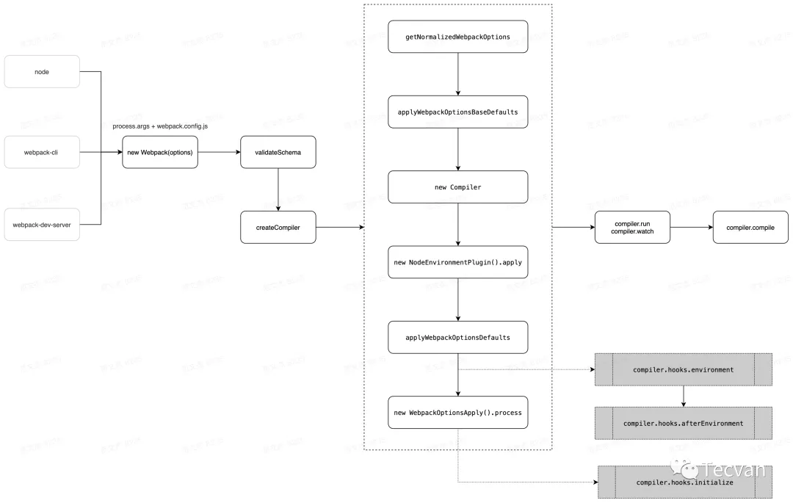
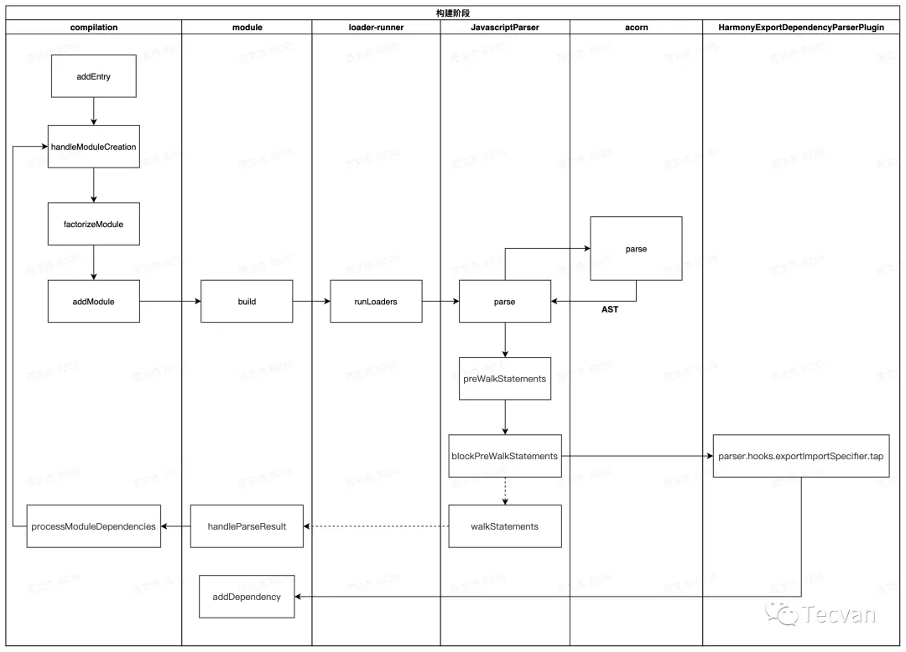
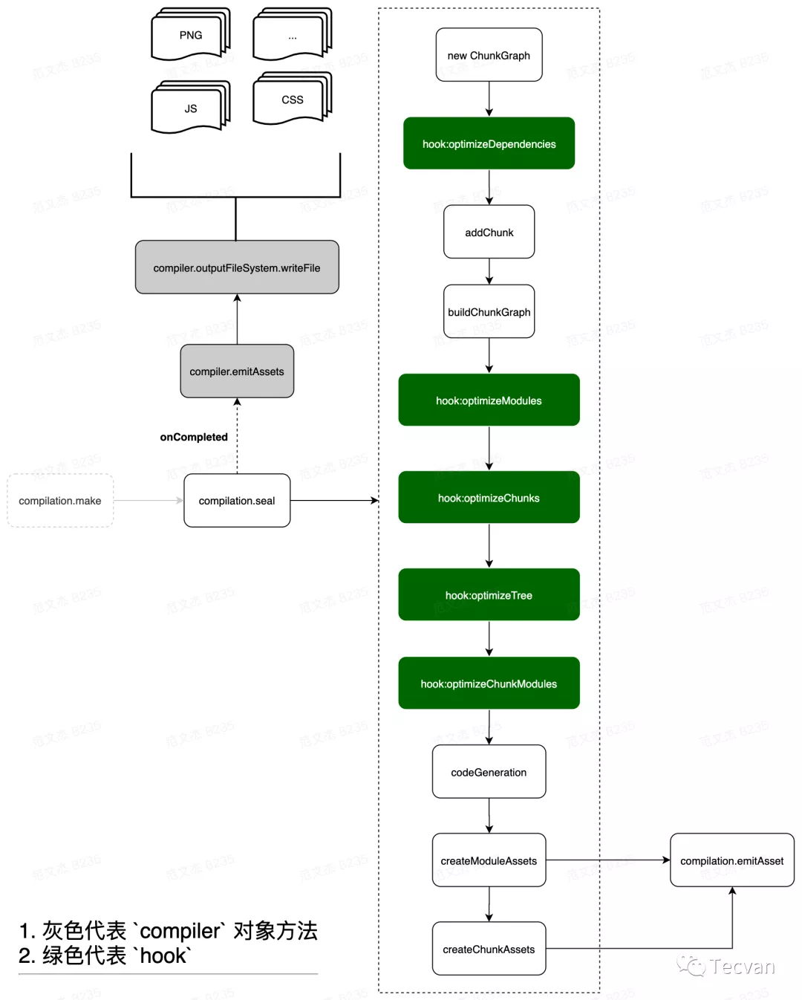
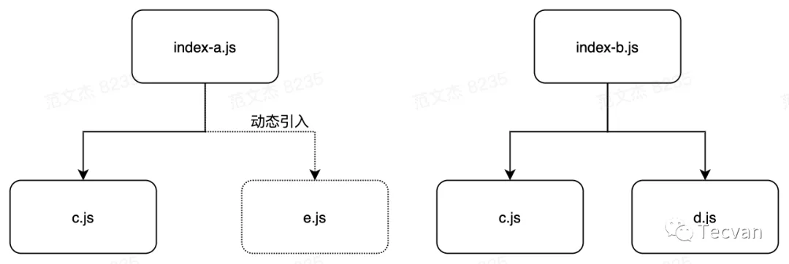
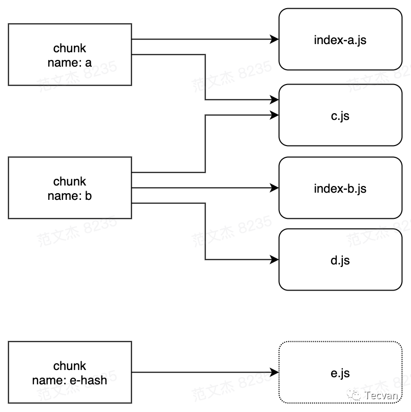
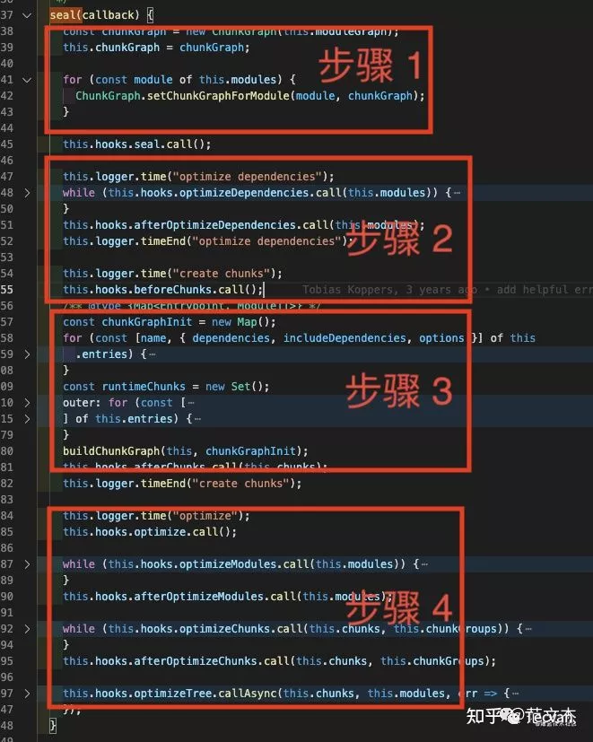
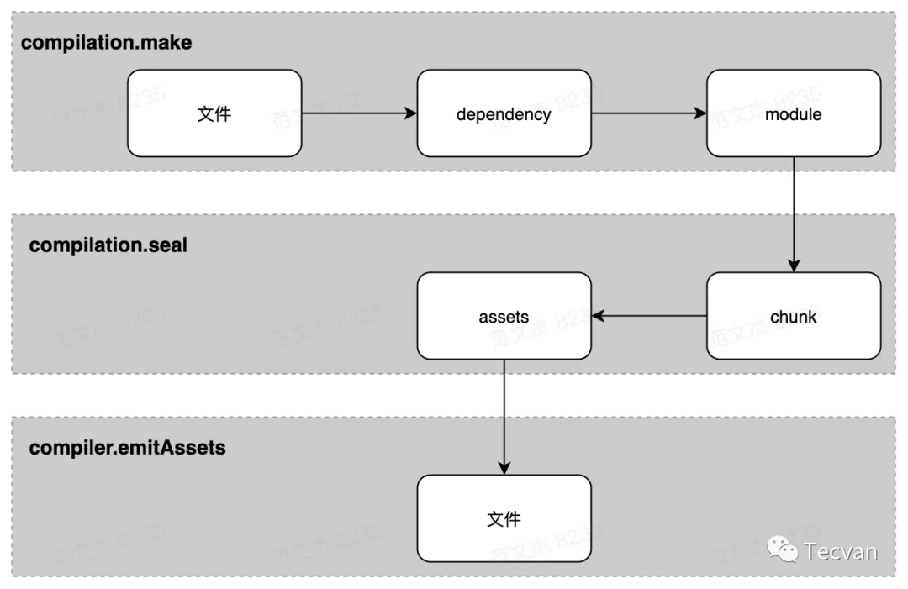
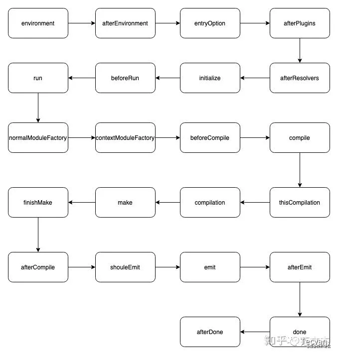
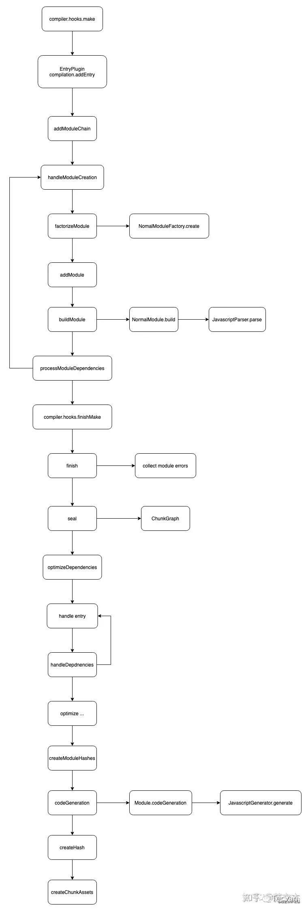

1. [webpack原理剖析](https://mp.weixin.qq.com/s/SbJNbSVzSPSKBe2YStn2Zw)
   1. 核心流程：核心完成了 内容转换 + 资源合并 两种功能，实现上包含三个阶段：
      1. 初始化阶段
         1. 初始化参数：从配置文件、配置对象和shell参数中读取，与默认配置合并生成最终配置参数
         2. 创建编译器对象：使用上边的参数创建compiler对象
         3. 初始化编译环境：包括注入内置插件、注册各种模块工厂、初始化 RuleSet 集合、加载配置的插件等
         4. 开始编译：执行compiler的run方法
         5. 确定入口：根据entry确定所有入口文件，调用compilation.addEntry将入口文件转换为dependence对象
      2. 构建阶段：
         1. 编译模块(make)：根据entry对应的dependence对象创建module对象，调用loader将模块转换为JS，调用JS解释器将JS内容转换为AST对象，然后递归查找该模块的所有依赖项。
         2. 完成模块编译：完成上述操作后，得到每个module的内容和**依赖关系图**
      3. 生成阶段：
         1. 输出资源(seal)：根据entry和module之间的依赖关系，组装成一个个包含多个模块的chunk，再把每个chunk转换成一个单独的bundle加入到输出列表当中，**这是最后可以修改内容的机会**
         2. 写入文件系统：将打包好的文件写到规定的文件当中
   2. 基础概念：
      1. Entry：编译入口，webpack 编译的起点
      2. Compiler：编译管理器，webpack 启动后会创建 compiler 对象，该对象一直存活知道结束退出
      3. Compilation：单次编辑过程的管理器，比如 watch = true 时，运行过程中只有一个 compiler 但每次文件变更触发重新编译时，都会创建一个新的 compilation 对象
      4. Dependence：依赖对象，webpack 基于该类型记录模块间依赖关系
      5. Module：webpack 内部所有资源都会以“module”对象形式存在，所有关于资源的操作、转译、合并都是以 “module” 为基本单位进行的
      6. Chunk：编译完成准备输出时，webpack 会将 module 按特定的规则组织成一个一个的 chunk，这些 chunk 某种程度上跟最终输出一一对应
      7. Loader：资源内容转换器，其实就是实现从内容 A 转换 B 的转换器
      8. Plugin：webpack构建过程中，会在特定的时机广播对应的事件，插件监听这些事件，在特定时间点介入编译过程
   3. 初始化阶段
      1. 基本流程

         

         1. 将`process.args + webpack.config.js`合成用户配置
         2. 调用validateSchema校验配置
         3. 调用`getNormalizedWebpackOptions + applyWebpackOptionsBaseDefaults` 合并出最终配置
         4. 创建 `compiler` 对象
         5. 遍历用户定义的 `plugins` 集合，执行插件的 `apply` 方法
         6. 调用 `new WebpackOptionsApply().process` 方法，加载各种内置插件。主要逻辑集中在 WebpackOptionsApply 类，webpack 内置了数百个插件，这些插件并不需要我们手动配置，WebpackOptionsApply 会在初始化阶段根据配置内容动态注入对应的插件，包括：
            1. 注入 EntryOptionPlugin 插件，处理 entry 配置
            2. 根据 devtool 值判断后续用那个插件处理 sourcemap，可选值：EvalSourceMapDevToolPlugin、SourceMapDevToolPlugin、EvalDevToolModulePlugin
            3. 注入 RuntimePlugin ，用于根据代码内容动态注入 webpack 运行时
         7. 到这里，compiler 实例就被创建出来了，相应的环境参数也预设好了，紧接着开始调用 compiler.compile 函数，compile之后经过跳转调用make，进入构建阶段，这里会触发make钩子
   4. 构建阶段
      1. 基本流程

         

         1. 调用 `handleModuleCreate` ，根据文件类型构建 `module` 子类
         2. **调用 loader-runner 仓库的 `runLoaders` 转译 module 内容，通常是从各类资源类型转译为 JavaScript 文本**
         3. **调用 acorn 将 JS 文本解析为AST**
         4. 遍历 AST，触发各种钩子
            1. 在 `HarmonyExportDependencyParserPlugin` 插件监听 `exportImportSpecifier` 钩子，解读 JS 文本对应的资源依赖
            2. 调用 `module` 对象的 `addDependency` 将依赖对象加入到 `module` 依赖列表中
         5. AST 遍历完毕后，调用 `module.handleParseResult` 处理模块依赖
         6. 对于 `module` 新增的依赖，调用 `handleModuleCreate` ，控制流回到第一步
         7. 所有依赖都解析完毕后，构建阶段结束
      2. 流程解释
         1. **这个过程中数据流 `module => ast => dependences => module` ，先转 AST 再从 AST 找依赖。这就要求 `loaders` 处理完的最后结果必须是可以被 acorn 处理的标准 JavaScript 语法**
   5. 生成阶段
      1. 基本流程：构建阶段围绕 module 展开，生成阶段则围绕 chunks 展开。经过构建阶段之后，webpack 得到足够的模块内容与模块关系信息，接下来开始生成最终资源了。代码层面，就是开始执行 compilation.seal 函数，seal 原意密封、上锁，我个人理解在 webpack 语境下接近于 “将模块装进蜜罐” 。seal 函数主要完成从 module 到 chunks 的转化，核心流程：

         

         1. 构建本次编译的 `ChunkGraph` 对象；
         2. 遍历 `compilation.modules` 集合，将 `module` 按 `entry/动态引入` 的规则分配给不同的 `Chunk` 对象；
         3. `compilation.modules` 集合遍历完毕后，得到完整的 `chunks` 集合对象，调用 `createXxxAssets` 方法
         4. `createXxxAssets` 遍历 `module/chunk` ，调用 `compilation.emitAssets` 方法将 `assets` 信息记录到 `compilation.assets` 对象中
         5. 触发 `seal` 回调，控制流回到 `compiler` 对象
            1. chunk规则：
               1. entry 及 entry 触达到的模块，组合成一个 chunk
               2. 使用动态引入语句引入的模块，各自组合成一个 chunk

               
               

            2. seal 函数步骤：
               1. 遍历 compilation.modules ，记录下模块与 chunk 关系
               2. 触发各种模块优化钩子，这一步优化的主要是模块依赖关系
               3. 遍历 module 构建 chunk 集合
               4. 触发各种优化钩子

               

      2. SplitChunksPlugin 的作用
         1. 在seal过程当中，第4个步骤触发 `optimizeChunks` 钩子，这个时候已经跑完主流程的逻辑，得到 chunks 集合，SplitChunksPlugin 正是使用这个钩子，分析 chunks 集合的内容，按配置规则增加一些通用的 chunk ：
   6. 资源形态流转

      

      1. compiler.make 阶段：
         1. entry 文件以 dependence 对象形式加入 compilation 的依赖列表，dependence 对象记录有 entry 的类型、路径等信息
         2. 根据 dependence 调用对应的工厂函数创建 module 对象，之后读入 module 对应的文件内容，调用 loader-runner 对内容做转化，转化结果若有其它依赖则继续读入依赖资源，重复此过程直到所有依赖均被转化为 module
      2. compilation.seal 阶段：
         1. 遍历 module 集合，根据 entry 配置及引入资源的方式，将 module 分配到不同的 chunk
         2. 遍历 chunk 集合，调用 compilation.emitAsset 方法标记 chunk 的输出规则，即转化为 assets 集合
      3. compiler.emitAssets 阶段：
         1. 将 assets 写入文件系统
   7. 钩子触发时机
      1. compiler

         

      2. compilation

         


2. [acorn](https://zhuanlan.zhihu.com/p/149323563)
   1. 定义：A tiny, fast JavaScript parser, written completely in JavaScript. 一个完全使用javascript实现的，小型且快速的javascript解析器。**acorn可以完成javascript代码解析工作，这个代码解析工作的产出即ast（抽象语法树）**
   2.
3. [按照问题来学习webpack](https://juejin.cn/post/7023242274876162084)
4. [npm install原理](https://www.jianshu.com/p/8beac6cb7309)-整体流程：
   1. 检查 .npmrc 文件：优先级为：项目级的 .npmrc 文件 > 用户级的 .npmrc 文件> 全局级的 .npmrc 文件 > npm 内置的 .npmrc 文件
   2. 检查项目中有无 lock 文件。
   3. 无 lock 文件：
      1. 从 npm 远程仓库获取包信息
      2. 根据 package.json 构建依赖树，构建过程：
         1. 构建依赖树时，不管其是直接依赖还是子依赖的依赖，优先将其放置在 node_modules 根目录。
         2. 当遇到相同模块时，判断已放置在依赖树的模块版本是否符合新模块的版本范围，如果符合则跳过，不符合则在当前模块的 node_modules 下放置该模块。
         3. 注意这一步只是确定逻辑上的依赖树，并非真正的安装，后面会根据这个依赖结构去下载或拿到缓存中的依赖包
      3. 在缓存中依次查找依赖树中的每个包
         1. 不存在缓存：
            1. 从 npm 远程仓库下载包
            2. 校验包的完整性
            3. 校验不通过：重新下载
            4. 校验通过：将下载的包复制到 npm 缓存目录
            5. 将下载的包按照依赖结构解压到 node_modules
         2. 存在缓存：
            1. 将缓存按照依赖结构解压到 node_modules
            2. 将包解压到 node_modules
      4. 生成 lock 文件
   4. 有 lock 文件：
      1. 检查 package.json 中的依赖版本是否和 package-lock.json 中的依赖有冲突。
      2. 如果没有冲突，直接跳过获取包信息、构建依赖树过程，开始在缓存中查找包信息，后续过程相同

5. 符号
   1. '~'（波浪符号）:他会更新到当前minor version（也就是中间的那位数字）中最新的版本。放到我们的例子中就是："exif-js": "~2.3.0"，这个库会去匹配更新到2.3.x的最新版本，如果出了一个新的版本为2.4.0，则不会自动升级。
   2. '^'（插入符号）: 这个符号就显得非常的灵活了，他将会把当前库的版本更新到当前major version（也就是第一位数字）中最新的版本。放到我们的例子中就是："vue": "^2.2.2", 这个库会去匹配2.x.x中最新的版本，但是他不会自动更新到3.0.0。
6. resolve: 配置模块如何解析
   1. alias: 创建 import 或 require 的别名
      1. 可以在给定对象的键后的末尾添加 $,以表示精准匹配

            ```
            resolve: {
               alias: {
                  xyz$: path.resolve(__dirname, 'path/to/file.js'),
               },
            },

            import Test1 from 'xyz'; // 精确匹配，所以 path/to/file.js 被解析和导入
            import Test2 from 'xyz/file.js'; // 非精确匹配，触发普通解析
            ```
   2. extensions: 在引用时，没有写后缀名称的话，按extensions数据中的顺序进行解析，如果有多个文件名字相同，后缀不同，则只按第一个解析，跳过后边的
      1. 设置了extensions属性时，会覆盖webpack的默认数组
      2. 默认数组为extensions:['.js', '.json']

7. devServer
   1. hot: true 热更新，只会更新更改的组件或者模块，不会整体刷新页面
   2. open: true 是否自动打开浏览器
   3. proxy:
      1. target: 将接受请求的服务器由本地服务器代理到target服务器，举例来说就是，我们是从本地起了一个服务器是localhost:8080，我们从浏览器输入url请求资源，接收这个请求的服务器是localhost:8080，如果我们使用了target为www.baidu.com,那么接收这个请求的服务器就是www.baidu.com，
      2. changeOrigin:true，这个字段是用来更改请求头中的host，请求头中的host是用来标记我们要请求的地址的，一个服务器中可能存在多个网站，例如一个服务器中有谷歌，百度，必应等，但是url解析出来都是同一个ip，这时候就需要host来标记出我们访问的是哪一个host。**用来配置是否跨域？存疑，查清除**
      3. ws：websockets是否需要代理，需要为true
      4. pathRewrite:重新配置路径，可以按照自己需求配置

         ```
         pathRewrite: {
            '^/api': '/'
            //pathRewrite: {'^/api': '/'} 重写之后url为 http://192.168.1.16:8085/xxxx
            //pathRewrite: {'^/api': '/api'} 重写之后url为 http://192.168.1.16:8085/api/xxxx
         }
         ```

8. Webpack chunk bundle
     1.   webpack的打包是从一个入口文件开始，也可以说是入口模块，入口模块引用这其他模块，模块再引用模块。Webpack通过引用关系逐个打包模块，这些module就形成了一个Chunk。如果我们有多个入口文件，可能会产出多条打包路径，一条路径就会形成一个Chunk。出了入口entry会产生Chunk，还有两种途径，下面会有介绍。
     2.   Bundle就是我们最终输出的一个或多个打包文件。确实，大多数情况下，一个Chunk会生产一个Bundle。但有时候也不完全是一对一的关系，比如我们把 devtool配置成'source-map'
     3.   Chunk是过程中的代码块，Bundle是结果的代码块。
     4.   Chunk是一些模块的封装单元。Chunk在构建完成就呈现为bundle。
     5.   产生chunk的途径
          1.   entry入口
          2.   异步加载模块
          3.   代码分割（code spliting）
9.  Webpakck loader plugin
     1.   loader 用于转换某些类型的模块，而插件则可以用于执行范围更广的任务。包括：打包优化，资源管理，注入环境变量。
     2.   loader 将按照相反的顺序执行。链中的第一个 loader 将其结果（也就是应用过转换后的资源）传递给下一个 loader，依此类推。最后，链中的最后一个 loader，返回 webpack 所期望的 JavaScript。
10. vue-loader 用于解析.vue文件。vue-template-compiler 用于编译模板。cache-loader 用于缓存loader编译的结果。thread-loader 使用 worker 池来运行loader，每个 worker 都是一个 node.js 进程
11. [source map](https://juejin.cn/post/6963076475020902436)、[第二篇](https://juejin.cn/post/6844903971648372743)、[七种模式](https://juejin.cn/post/6844903450644316174)
12. [chainWebpack与configureWebpack](https://www.jianshu.com/p/27d82d98a041)、[第二篇](https://segmentfault.com/a/1190000019920162)
     1.   chainWebpack通过链式编程的形式，来修改默认的webpack配置
     2.   configureWebpack通过操作对象的形式，来修改默认的webpack配置
13. configureWebpack对象返回的值会被webpack-merge合并到最终的webpack配置中，如果你需要基于环境有条件的配置行为，或者想要直接修改配置，可以使用这个。该方法的第一个参数就是已经解析好的配置，你可以直接修改配置，或者返回一个将会被合并的对象。像这样：
14. webpack-merge提供了一个merge连接数组和合并对象创建新对象的函数。如果遇到函数，它将执行它们，通过算法运行结果，然后再次将返回值包装在函数中。**Promises are not supported**

      ```
      const { merge } = require('webpack-merge');

      // Default API
      const output = merge(object1, object2, object3, ...);

      // You can pass an array of objects directly.
      // This works with all available functions.
      const output = merge([object1, object2, object3]);

      // Keys matching to the right take precedence:
      const output = merge(
      { fruit: "apple", color: "red" },
      { fruit: "strawberries" }
      );
      console.log(output);
      // { color: "red", fruit: "strawberries"}
      ```
   1. [使用](https://www.jianshu.com/p/13229b672d66)：如果数据类型不一样，后面的直接完全覆盖前面的，如果两者都是基础数据类型，后面的也会覆盖前面的（这里省略）。如果两者都是数组的话，二者合并

      ```
      let a = {
      name:{}
      }
      let b = {
      name:''
      }

      // result
      {
      name:''
      }

      let a = {
      age:[1,2]
      }
      let b = {
      age:[3,4,5]
      }

      //result
      {
      age:[1,2,3,4,5]
      }

      完整 code
      const { merge } = require('webpack-merge');
      let a = {
      name:{},
      age:[1,2],
      detail:{
         location:'Chengdu'
      }
      }
      let b = {
      name:'',
      age:[3,4,5],
      detail:{
         district:'ShuangLiu'
      }
      }
      console.log(merge(a,b));

      //result
      {
         name: '',
         age: [1,2,3,4,5],
         detail: { location: 'chengdu', district: 'shuangliu' }
      }
      ```
   2. 对比 Object.assign，这个函数就是后者覆盖前者，是个浅拷贝

15. [.tap()  tapable](https://www.jianshu.com/p/273e1c9904d2)、[第二篇](https://juejin.cn/post/6975321674015047693#heading-6)
    1.  tap 方法用于注册事件，支持传入两个参数，第一个参数为事件名称，在 Webpack 中一般用于存储事件对应的插件名称（名字随意，只是起到注释作用）， 第二个参数为事件处理函数，函数参数为执行 call 方法触发事件时所传入的参数的形参。
16. [webpack优化](https://juejin.cn/post/6844904071736852487)
17. [打包优化](https://juejin.cn/post/6971743815434993671#heading-13)
    1.  开发环境，development
        1.  source-map
            1.  开启source-map配置很简单：devtool:"source-map"。source-map的值有多种类型，简单解释下。
            2.  source-map 各选项常用组成：[inline-|eval-][cheap-[module-]]source-map
                1.  inline：内联，一个chunk生成一个总的source-map。 内联不生成 map.js 文件，而是通过 data-url 的形式直接注入到 chunk 里；内联构建速度更快。
                2.  eval：内联，每一个文件生成一个source-map
                3.  cheap：外部，报错位置只能精确到行。
                4.  cheap-module：显示第三方库的source-map
        2.  热更新
            1.  devServer启动一个代理服务器。启动过后修改代码就会自动刷新浏览器了，但这个并不是HMR。HMR：模块热替换，也可以理解为局部替换。替换、添加或删除 模块，而无需重新加载整个页面。通过设置hot: true
    2.  生产环境，production
        1.  oneOf
            1.  文件会去匹配rules下面的每一个规则，即使已经匹配到某个规则了也会继续向下匹配。而如果将规则放在 oneOf 属性中，则一旦匹配到某个规则后，就停止匹配了。
        2.  缓存：在编译打包时可对文件做缓存，有两种方式
            1.  自身带有缓存功能的loader，如babel-loader,vue-loader
            2.  使用专门的loader（cache-loader）
            3.  **开启缓存后，对于未改动的文件，webpack直接从缓存中读取而不用再次编译，大大加快构建速度。**
        3.  多进程打包（thread-loader）
            1.一般只有在编译花费时间较长时才需要使用 thread-loader，因为这个 loader 启动和通信都是有开销的(大概600ms,可以看13)，如果时间较短，使用这个 loader 就得不偿失了。
        4.  外部扩展(externals)：externals 用来告诉 Webpack 要构建的代码中使用了哪些不用被打包的模块，这些模块可能是通过外部环境（如CDN）引入的。
        5.  DLL（动态链接库）:使用dll技术**对公共库进行提前打包**，可大大提升构建速度。公共库一般情况下是**不会有改动**的，所以这些模块只需要编译一次就可以了，并且可以提前打包好。在主程序后续构建时如果检测到该公共库**已经**通过dll打包了，就不再对其编译而是直接**从动态链接库中获取**。实现dll打包需要以下三步：
            1.  抽取公共库，打包到一个或多个动态链接库中。
            2.  将打包好的动态链接库在页面中引入。
            3.  主程序使用了动态链接库中的公共库时，不能被打包入bundle，应该直接去动态链接库中获取。
        6.  Tree Shaking（树摇）：移除 JavaScript 上下文中的未引用代码(dead-code)。将整个应用程序想象成一棵树，绿色的树叶表示实际用到的source code（源码）和library（库），灰色的树叶则表示未被使用的代码，是枯萎的树叶。为了除去这些死去的无用的树叶，你需要摇动这棵树使其落下。这就是Tree Shaking的名称由来。**总的来说，删掉没用过的代码**，
            1.  Webpack4中还做不到，Webpack4中只会去除从未被使用的模块
            2.  如何设置：将mode设置为"production"，Webpack就自动启用Tree Shaking了
            3.  **注意：**源代码必须使用 静态的 ES6 模块化语法。原因是Webpack在构建时通过静态分析，分析出代码之间的依赖关系。而动态导入如require语法只有在执行时才知道导入了哪个模块，所以无法做Tree Shaking。三方库无法做Tree Shaking。原因猜测是Webpack无法保证三方库导入是否会直接对程序产生影响。
        7.  代码分割：Webpack**默认**会将所有依赖的文件打包输出到**一个**bundle.js中（单入口时），当应用程序逐渐复杂，这个bundle.js文件也会**越来越大**，浏览器加载的速度也会越来越慢，所以就需要使用代码分割来将不同代码单独打包成不同chunk输出。**方法有两种**：
            1.  通过optimization将公共代码单独打包成chunk
            2.  import动态导入，当想要根据业务拆分bundle时推荐用这种方式。import动态导入的模块Webpack会将其作为单独的chunk打包。
18. [手写js打包器](https://juejin.cn/post/6844904032587382797)
19. @babel/preset-env是一个智能的babel预设, 让你能使用最新的JavaScript语法, 它会帮你转换成代码的目标运行环境支持的语法, 提升你的开发效率并让打包后的代码体积更小
20. 各个loader的作用
    1.  style-loader 就是将处理好的 css 通过 style 标签的形式添加到页面上，核心原理（博客看问题1）

            ```
            const content = `${样式内容}`
            const style = document.createElement('style');
            style.innerHTML = content;
            document.head.appendChild(style);
            ```
         如果希望可以通过 CSS 文件的形式引入到页面上，需要使用mini-css-extract-plugin
    2.  file-loader：解决图片引入问题，并将图片 copy 到指定目录，默认为 dist
    3.  url-loader：依赖 file-loader，当图片小于 limit 值的时候，会将图片转为 base64 编码，大于 limit 值的时候依然是使用 file-loader 进行拷贝
    4.  img-loader：压缩图片
    5.  babel-loader 使用 Babel 加载 ES2015+ 代码并将其转换为 ES5

21. 各个plugin的作用
    1.  如果我想打包后的资源文件，例如：js 或者 css 文件可以自动引入到 Html 中，就需要使用插件 html-webpack-plugin来帮助你完成这个操作
22. .browserslistrc文件，用来配置babel和postcss的浏览器配置，如果不配置该文件babel-loader不生效，postcss-loader会报错

         ```
         # 换行相当于 and
         last 2 versions # 回退两个浏览器版本
         > 0.5% # 全球超过0.5%人使用的浏览器，可以通过 caniuse.com 查看不同浏览器不同版本占有率
         IE 10 # 兼容IE 10
         ```

23. .babelrc.js或babel.config.js，为了避免 webpack.config.js 太臃肿，建议将 Babel 配置文件提取出来
24. Webpack 文件指纹策略是将文件名后面加上 hash 值，这块与缓存结合,filename: "\[name]\[hash:8]\[ext]"，三种hash值
    1.  hash ：每次构建生成的唯一 hash 值，任何一个文件改动，整个项目的构建 hash 值都会改变；
    2.  chunkhash：根据 chunk 生成 hash 值，文件的改动只会影响其所在 chunk 的 hash 值；
    3.  contenthash：根据文件内容生成hash 值，每个文件都有单独的 hash 值，文件的改动只会影响自身的 hash 值；
    4.  其他的占位符的意义
        1.  ext	文件后缀名
        2.  name	文件名
        3.  path	文件相对路径
        4.  folder	文件所在文件夹
25. [查看打包后各包的大小npm run build --report，会在dist里边生成一个report.html](https://blog.csdn.net/yunchong_zhao/article/details/104374295/)
26. [vue 打包时间统计](https://blog.csdn.net/a736755244/article/details/113634393)
27. [量化打包时间](https://www.cnblogs.com/zhurong/p/12603887.html)、[第二篇](https://segmentfault.com/a/1190000020672528)
28. config.optimization.delete('splitChunks')作用
    1.  升级到vue-cli3之后，默认编译是对代码进行分割，会生成许多chunk，有利于页面加载速度。但是如果我们编译后的结果需要给第三方使用，比如前端微服务，这个时候，只提供一个js文件和css文件将更加方便也更加合理。
    2.  [第二个](https://trangle.top/article/35/%E9%81%BF%E5%85%8D%20Vue%20CLI%203%20%E5%A4%9A%E9%A1%B5%E6%97%B6%E5%BC%95%E5%85%A5%E4%B8%8D%E9%9C%80%E8%A6%81%E7%9A%84%E4%BB%A3%E7%A0%81)
    3.  项目里边用到这个是因为不想在pages以外生成其他的chunks，为了更清晰，如果以后需要优化打包速度的话，可以研究一下splitChunks
29. [splitChunks](https://blog.csdn.net/weixin_34294049/article/details/97278751)
30. [treeshaking](https://juejin.cn/post/7002410645316436004)、[第二篇](https://mp.weixin.qq.com/s?__biz=Mzg3OTYwMjcxMA==&mid=2247484579&idx=1&sn=f687adfc6a7ea155c0fdf504defb65b5&chksm=cf00b9daf87730cc2bf7934f6fd40c50ad28ef4e418922740aedacc998f2fa62388d4c81649c&scene=178&cur_album_id=1856066636768722949#rd)
31. 钩子介绍
    1.  compiler.hooks.compilation ：
        1.  时机：启动编译创建出 compilation 对象后触发
        2.  参数：当前编译的 compilation 对象
        3.  示例：很多插件基于此事件获取 compilation 实例
    2.  compiler.hooks.make：
        1.  时机：正式开始编译时触发
        2.  参数：同样是当前编译的 compilation 对象
        3.  示例：webpack 内置的 EntryPlugin 基于此钩子实现 entry 模块的初始化
    3.  compilation.hooks.optimizeChunks ：
        1.  时机：seal 函数中，chunk 集合构建完毕后触发
        2.  参数：chunks 集合与 chunkGroups 集合
        3.  示例：SplitChunksPlugin 插件基于此钩子实现 chunk 拆分优化
    4.  compiler.hooks.done：
        1.  时机：编译完成后触发
        2.  参数：stats 对象，包含编译过程中的各类统计信息
        3.  示例：webpack-bundle-analyzer 插件基于此钩子实现打包分析
32. [webpack4环境配置之process.env](https://www.jianshu.com/p/19d199f93045)
