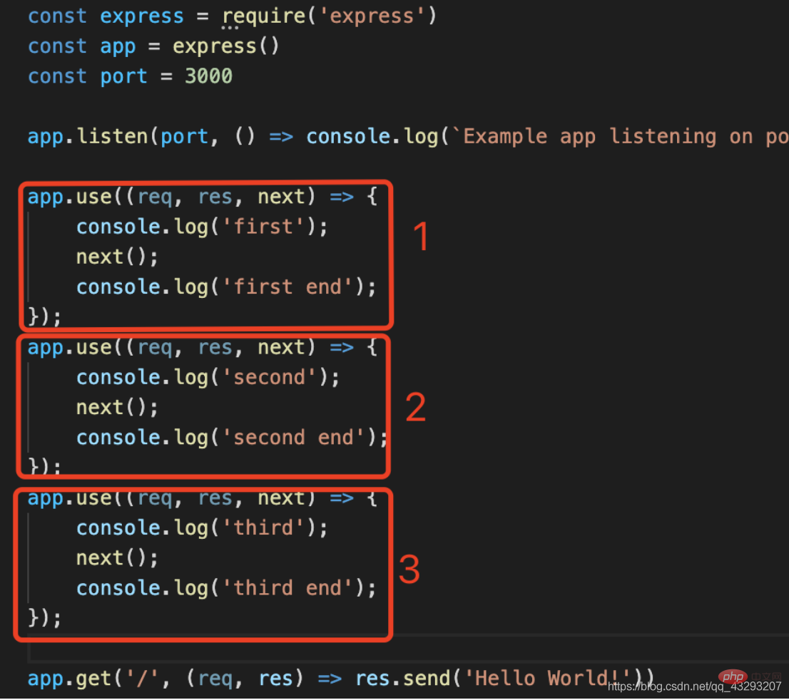
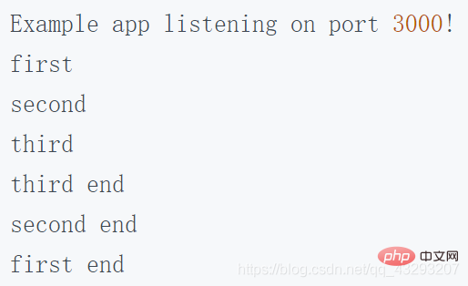

## egg.js

1. this.ctx: 当前请求的上下文 Context 对象的实例，通过它我们可以拿到框架封装好的处理当前请求的各种便捷属性和方法。
2. this.app: 当前应用 Application 对象的实例，通过它我们可以拿到框架提供的全局对象和方法。
3. 我输出了一下：**this.ctx.app = this.app**
4. this.service：应用定义的 Service，通过它我们可以访问到其他业务层，等价于 this.ctx.service 。
5. this.config：应用运行时的配置项。
6. this.logger：logger 对象，上面有四个方法（debug，info，warn，error），分别代表打印四个不同级别的日志，使用方法和效果与 context logger 中介绍的一样，但是通过这个 logger 对象记录的日志，在日志前面会加上打印该日志的文件路径，以便快速定位日志打印位置。
7. **可以往this里边跳转一下，就能看见这几个东西**

### 注意和Tips

#### 注意

1. controller下边所有的方法，都必须使用async的方式，这是要求
2. egg要求必须使用严格模式'usr strict';
3. 感觉egg.js会把this中的ctx返回，因为get请求会拿到ctx.body中的内容在网页中显示，post请求会把ctx.body中的内容作为请求的结果返回（待看）


### 目录结构

1. run：项目运行后的临时文件，用于保证项目的正确运行，都是临时文件，在运行时使用
2. test：单元测试目录，会用的比较多，因为在app里边增加一个controller，都需要单元测试，在test/app/controller/下都要新建一个xx.test.js的单元测试文件
3. typings：ts配置文件
4. package.json指令
   1. start：生产环境中使用的指令
   2. dev：开发过程中使用的指令
   3. start与dev区别：
      1. start一直在后台运行，不会占用中断，停止时必须使用yarn stop停止
      2. dev终端会被占用，但是在更改代码时，刷新页面就ok了

### Controller

1. 作用：简单来说，就是处理用户的输入，处理后返回相应的结果。一般情况下分为三种使用方式：
   1. restful形式：接收用户提供的参数，从数据库中查找数据返还给用户，或者更新数据库中的数据
   2. HTML：根据用户访问的url不同，返回不同的html页面
   3. 代理服务器，中间层形式：将用户的请求转发给其他服务器，在把其他服务器的结果返还回去
2. 创建新的controller
  1. egg必须使用严格模式，所以controller里边第一行必须要使用`'usr strict';`
  2. 从egg中拿到controller

      ```js
      const Controller = require('egg').Controller

      class LearnEggController extends Controller {}
      ```

  3. 定义使用的方法，**必须使用async，规定**

      ```js
      class LearnEggController extends Controller {
        async testFunc () {
          const { ctx } = this // 从this中拿到上下文
          ctx.body = '<h1>testttttttt</h1>'
        }
      }
      ```

  4. 导出Controller

      ```js
      module.exports = LearnEggController
      ```

  5. 定义对应的路由，使用

### 单元测试


### get传参

1. 自由传参模式：随便传，想传几个传几个

```js
class TestController extends Controller {
  async testParams () {
    const { ctx } = this
    ctx.body = ctx.query // url的中query
  }
}
```

2. 严格传参模式：只接受固定名称的变量，如果少传多传就404，**这个实在配置路由的时候做限制**（感觉类似vue中的动态路由），route/:params/:params2。可以接收多个参数

```js
 路由中定义
module.exports = app => {
  const { router, controller } = app
  router.get('/:name', controller.xx.testParams)
}


 controller中
 async testParams () {
   const ctx = this.ctx
   ctx.body = ctx.parmas.name
 }
```

### post

1. rest client插件来测试post，和postman用法一样，轻量级插件
   1. 文件名以.http结尾
   2. 用法及传递参数

      ```
      POST http://127.0.0.1:7001/add
      Content-Type: application/x-www-form-urlencoded

      name=Lightman // 传递参数前记得空一格
      ```

   3. seng msg被403forbidden，原因是因为egg有个csrf配置，禁掉了post，需要在config.default.js里边设置

      ```js
      config.security = {
        csrf: {
          enable: false
        }
      }
      ```

2. 接收post参数

    ```js
    async testPost () {
      const { ctx } = this
      const params = ctx.request.body
      ctx.body = {
        status: 200,
        data: params
      }
    }
    ```

    ```js
    // 路由定义为

    router.post('/add', controller.xx.testPost) // xx为controller的文件名
    ```

    ```
    rest client发送的请求为

    POST http://127.0.0.1:7001/add
    Content-Type: application/x-www-form-urlencoded

    name=Lightman
    ```
    这样写好之后，当我们往这个路由中发送post请求时，客户端收到的结果就是
    ```json
    {
      "status": 200,
      "data": {
        "name": "Lightman"
      }
    }
    ```

### Service

1. service文件夹必须在app文件夹下
2. 定义service

    ```ts
    // 创建testSevice.js文件
    const Service = require('egg').Service

    class TestService extends Service {
      async getFunction (id: string) {
        retirm {
          id,
          name: 'Lightman'
        }
      }
    }
    ```

3. 使用

```ts
async testService () {
  cosnt { ctx } = this
  const res = await ctx.service.testService.getFunction(1001)
  ctx.body = res
}
```

### [ejs](https://ejs.bootcss.com/#install)

1. 基础用法

```js
let ejs = require('ejs'),
    people = ['geddy', 'neil', 'alex'],
    html = ejs.render('<%= people.join(", "); %>', {people: people});
```
```html
<% for (let i = 0; i < people.length; i++) { %>
<div><%= people[i] %></div>
<% } %>

<script src="ejs.js"></script>
<script>
  let people = ['geddy', 'neil', 'alex'],
      html = ejs.render('<%= people.join(", "); %>', {people: people});
</script>
```

2. 标签含义
   1. `<%` '脚本' 标签，用于流程控制，无输出。
   2. `<%_` 删除其前面的空格符
   3. `<%=` 输出数据到模板（输出是转义 HTML 标签）
   4. `<%-` 输出非转义的数据到模板
   5. `<%#` 注释标签，不执行、不输出内容
   6. `<%%` 输出字符串 '<%'
   7. `%>` 一般结束标签
   8. `-%>` 删除紧随其后的换行符
   9. `_%>` 将结束标签后面的空格符删除

3. include：公用代码片段

    ```
    <% include ./header.html %>
    <div>xixixixixi</div>
    <% include ./fotter.html %>
    ```

4. public：静态文件

5. egg中配置ejs
   1. delimiter：在ejs中不想用%可以用这个参数替换成自己想用的符号，比如$，**最好别用**

      ```
      <% %> => <$ $>
      ```

   2. [layout](https://openbase.com/js/egg-view-ejs/documentation)：在配置用配置layout，layout: 'layout.html'。在layout.html中，写入<%- body %>，就会在这个位置渲染render中对应的文件

      ```js
      // app/view/layout.ejs

      <%- body%>

      // app/controller/render.js
      exports.ejs = async ctx => {
        const locals = {
          data: 'world',
        };

        const viewOptions = {
          layout: 'layout.ejs'
        };

        await ctx.render('hello.ejs', locals, viewOptions);
      };
      ```

### [中间件](https://juejin.cn/post/7090816041915252750)

1. 中间件定义：**中间件就是 匹配路由之前 或者 匹配路由完成后 做的一系列的操作，我们就可以把它叫做中间件。**
2. 中间件做的事情：**收到请求之后，可以对请求做出更改，返回响应之前可以更改响应。连惯着说就是收到请求之后做出相应之前做一些事情。**
3. 功能
   1. 执行任何代码；
   2. 修改请求和响应对象；
   3. 终结请求-响应循环；
   4. 调用堆栈中的下一个中间件；
4. egg中间件： Egg 是基于 Koa 实现的，所以 Egg 的中间件形式和 Koa 的中间件形式是一样的，都是基于洋葱圈模型。

    
    
    

1. 作用
   1. 可以在中间件next( )函数之前对客户端发来的请求进行一些操作
   2. 也可以在next( )函数之后对返回给前端的内容进行一些操作
2. 约定：在app下创建middleware文件夹
3. 中间件中options是一个固定参数，返回值是一个异步函数，参数也是固定的

    ```
    module.exports = options => {
      return async (ctx, next) => {
        ...

        await next()
      }
    }
    ```
  有next才会向下进行

3. 如果全局使用，需要在config下配置

    ```
    config.middleware = ['中间件的名字']
    ```

4. router中间件的使用
   1. 在router.js中导入中间件
   2. 拿到中间件

      ```
      const myMiddleWare = app.middleware.myMiddleWare()
      ```

   3. 在想要使用的路由的地方作为第二个参数传进去使用

      ```
      router.get('/xx', myMiddleWare, controller.xx.xxx)
      ```

### application的拓展

1、 对application的拓展指的是

    ```
    const { ctx, app } = this
    ```
  指的是拓展这个app增加功能，比如增加一个app.testZjm()方法

2. 方法：**在app文件夹下增加extend文件夹，里边创建application.js，这个是约定**

    ```js
    // application.js

    module.exports = {
      // 方法拓展
      currentTime () {
        console.log('testZjm')
      }

      // 属性拓展
      get timeProp () {
        retrun currentTime()
      } // 这里使用的时候直接app.timeProp就行，感觉和计算属性差不多
    }
    ```

### context的拓展

1. 方法：**在app文件夹下增加extend文件夹，里边创建context.js，这个是约定**

### request的拓展

1. 这个拓展，拓展的是this.ctx.request
2. 方法：**在app文件夹下增加extend文件夹，里边创建request.js，这个是约定**

    ```js
    // application.js

    module.exports = {
      get myToken () {
        return 'token'
      }
    }
    ```

3. this.ctx.request.myToken

### response的拓展

1. 方法：**在app文件夹下增加extend文件夹，里边创建response.js，这个是约定**

    ```js
    // application.js

    module.exports = {
      set myToken () {
        return 'token'
      }
    }

    // controller
    ctx.response.myToken = 'zjmmmm'
    ```


### helper的拓展

1. 方法：**在app文件夹下增加extend文件夹，里边创建helper.js，这个是约定**
2. helper一般都是一些功能性的方法和函数
3. 使用方式

    ```js
    // helper.js
    module.exports = {
      imgToBase64 () {
        .......
      }
    }

    // controller
    const img = ctx.helper.imgToBase64()
    ```

### [定时任务](https://www.eggjs.org/zh-CN/basics/schedule)

1. app文件夹下创建schedule文件夹
2. 使用方法

```js
// 在文件夹下创建，例如get_time.js
const Subscription = require('egg').Subscription

class GetTime extends Subscription {
  // 需要两个东西才能运行起来
  // 静态的get方法
  static get mySchedule () {
    return {
      interval: '3s'; // 执行间隔时间
      cron: '* * * * * *'; // 这个也是定时参数，和上边用一个，第一个*代表秒，以此类推分时天(一个月里的哪一天)月，最后一个每周的哪一天，'*/3 * * * * *'这个表示3秒执行一次
      type: 'worker';
    }
  }

  // 对应的异步函数
  async mySchedule () {
    // 要做的事情
  }
}

module.exports = GetTime

// 可以简写为

module.exports = {
  schedule: {
    cron: '*/3 * * * * *';
    type: 'worker';
  },
  async mySchedule () {
    // ......
  }
}
```

3. 参数说明
   1. type：任务默认支持两种类型，worker 和 all，他们两个都支持interval和corn的定时方式，只是当到执行时机时，会执行定时任务的 worker 不同：
      1. worker 类型：每台机器上只有一个 worker 会执行这个定时任务，每次执行定时任务的 worker 的选择是随机的。
      2. all 类型：每台机器上的每个 worker 都会执行这个定时任务。
   2. 定时方式
      1.  interval: '3s'; // 执行间隔时间
      2.  cron: '* * * * * \*'; //第一个\*代表秒0-59，以此类推分(0-59)时(0-23)天(一个月里的哪一天1-31)月(1-12)，最后一个每周的哪一天(0-7，0 or 7都是周日)，'*/3 * * * * *'这个表示3秒执行一次
   3. cronOptions: 配置 cron 的时区等
   4. immediate：配置了该参数为 true 时，这个定时任务会在应用启动并 ready 后立刻执行一次这个定时任务。
   5. **disable：配置该参数为 true 时，这个定时任务不会被启动。**
   6. env：数组，仅在指定的环境下才启动该定时任务。

### 数据库

1. 如果想用mysql需要安装egg-mysql
2. 连接数据库
   1. 做config里边进行配置

```js
config.mysql = {
  app: true // 是否挂在到app下边
  agent： false // 是否挂在到代理下边，默认为false
  client: { // 连接数据库的信息
    host: '127.0.0.1' // 数据库的地址
    port: '3306' // 数据库的端口
    user: 'root'
    password: 'root'
    datebase: 'test-zjm' // 连接哪个数据库
  }
}
```

3. app.mysql.select('')
4. app.mysql.insert('')
5. app.mysql.update('')
6. app.mysql.delete('')

