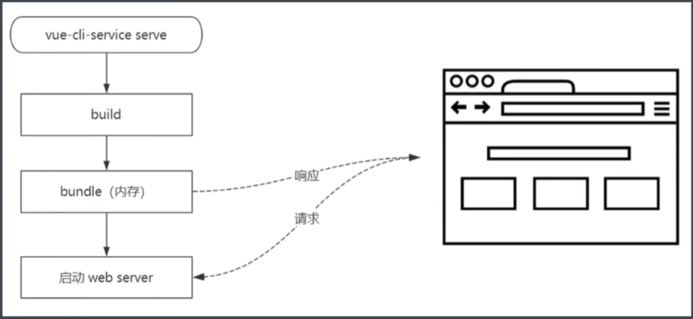
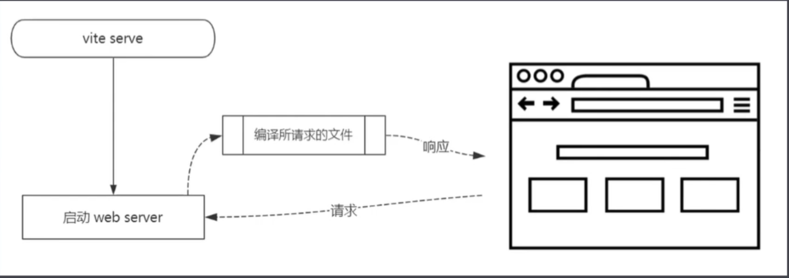
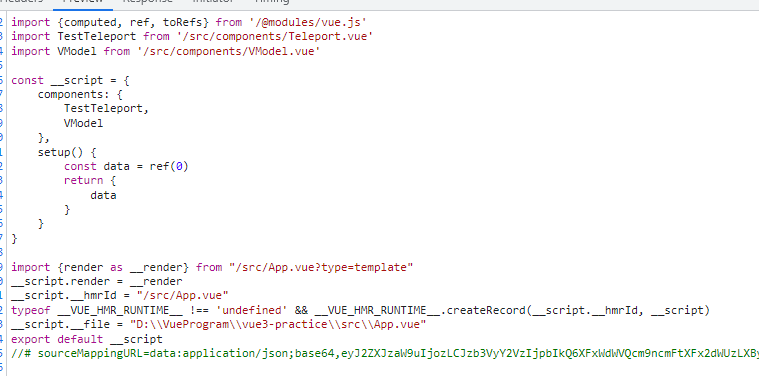

1. Composition API
   1. setup()
   2. ref()
   3. reactive()
   4. toRef(obj, 'obj.property')
   5. toRefs(obj)
2. teleport
3. fragments
   1. vue2中我们只能有1个根，vue3中我们可以有多个根节点，这是由于fragments的功劳，**具体原因没说，以后可以看看**

        ```
        // 原来
        <template>
          <div>
            <header />
            <main />
            <footer>
          </div>
        </template>

        // 现在
        <template>
          <header />
          <main />
          <footer>
        </template>
        ```

4. Emits
5. custom render 自定义渲染器：可以自定义渲染逻辑，
6. 全局api global
7. 摇树优化
8. v-model变化
9. vite 与传统的打包工具的区别
   1.  开发环境vite不进行打包
       1.  传统工具的流程

            

            先进行构建打包，将**打包后的文件存放到内存当中**(虽然我们没有看见打包后的文件，也就是dist，但是它仍然执行了打包操作，然后放入了内存当中)，然后启动server服务，然后浏览器向server发送请求，从内存取出数据进行响应

       2.  vite打包流程

            

            开发环境不打包，直接启动server服务，然后浏览器发送请求，然后浏览器请求哪个文件，server就按照es模块化的语法去加载哪个模块就可以了。
               1. 一个问题，为什么可以实现这个，为什么原来不行？**随着各大浏览器对于es6的支持程度越来越好，js标准的模块化的支持度的提高，各大浏览器可以很好地识别es module。**

       3.  为什么传统文件要进行打包
           1.  我们开发过程当中，高阶语法需要转义，es6 7 8 的语法很多浏览器是不支持的
           2.  各种组件之间、以及不同文件之间的联系，需要进行代码合并，js、css也需要合并
           3.  有些类型文件，浏览器无法识别，例如.vue文件

       4.  vite创建项目方法？ **看官网**
       5.  vite不打包，在浏览器中显示的文件类型也是xx.vue的格式，浏览器是怎么识别的？
           1.  vite会对.vue文件进行编译，编译成js文件，浏览器收到的response里边，.vue文件的content-type是application/javascript，**虽然浏览器收到的还是.vue文件，但是会当成js来处理，浏览器中认的不是后缀名，认的是文件类型**

                

       6.  vue3 + vue-cli更改成vue3 + vite
           1.  把文件中的@全部都替换掉，vite不能识别@，[但是可以在vite.confit.js里边配置对应的alias](https://juejin.cn/post/7017701897662365709)
           2.  保持环境一致，替换package.json中的内容，将vue-cli相关的东西替换成vite
           3.  [配置对应的环境文件 .env.development和.env.production](https://www.cnblogs.com/yuarvin/p/15719657.html)
               1.  loadEnv()参数
                   1.  mode：模式
                   2.  envDir：环境变量配置文件所在目录
                   3.  prefix：接受的环境变量前缀，默认为 VITE_，这就应证了文档中提到的内容
       7.  在vue2的项目中使用vite，需要使用一个插件vite-plugin-vue2
           1.  在vite当中，用户想使用哪种框架来开发，需要在vite.config.js里边以插件的形式来使用，@vitejs/plugin-vue默认使用vue3，所以需要使用上边的框架
       8.  **具体的webpack配置如何迁移，直接去vite官网上查找**