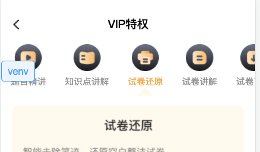
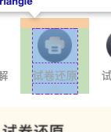
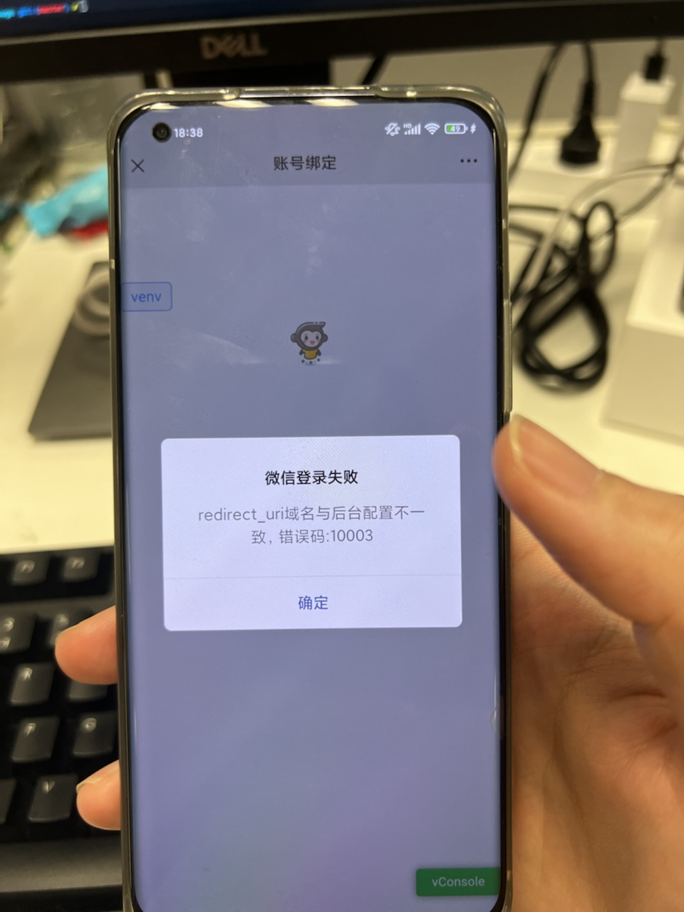

1. 尽量少修改公共的东西，做判断的话在自己写需求的地方加判断
2. 如果能从数据层面解决问题就不要增加不必要的代码
3. 虚环境：可以在本地或者测试环境上，将请求代理到swagger上边，这样的话就可以使用swagger的mock数据了，swagger里边的调试那里可以测试请求，那边的数据可以拿过来mock用
4. 虚环境的添加：
    1.  在页面对应的template里边添加一个js

            ```
            <% if (process.env.VUE_APP_CONFIG === 'test' || process.env.VUE_APP_CONFIG === 'dev') {
            %>
            <script src="https://xyks.yuanfudao.biz/h5/venv-tools/venv-tools-0.0.3.js"></script>
            <% } %>
            ```
        需要注意的是，if的判断条件，不同项目里边关于test和dev的定义可能是不一样的，这次碰到的是，vue-cli3的项目里边是上边这种，vue-cli2里边是process.env.NODE_ENV === 'production'，process.env.NODE_ENV === 'development'

5. 刘海屏与安全区
6. VIP专区页，试卷还原模块，点金更多触发两次页面，原因是因为在模块整体加了一个跳转来实现点击模块任意位置都可以跳转，然后在更多那边也有一个点击事件是跳转，所以当点击更多时，会触发两次
    1.  解决方法：阻止更多那边的click事件的冒泡，@click.stop
7. 考虑各种页面跳入同一个页面，这个页面back按钮的，function情况，是closeWebview还是go(-1)
8. border-radius 与 overflow的问题
    1.  父元素设置了barder-radius，子元素有可能会把父元素的圆角盖住
    2.  可以通过给父元素设置overflow:hidden解决
9. 我们隐藏了webview自带的bar，手机的返回按钮调取的是我们传给客户端的trigger的方法，可以通过WebView来进行设置

        ```
        WebView.setLeftButton({
            trigger: () => {
                .....leftButton的function.....
            }
        })
        ```

10. 写代码的时候要考虑性能优化，减少发送请求，在购买混入那边，将请求客户端的桥方法放在了混入的mounted里边，混入在selector里边与VipPurchase里用了两次，所以mounted了两次，那个请求也就发了两次
11. **另外一个性能问题：让数据请求的时机更早一点，例子**
     1.   和问题107一起看，我的写法是在购买成功后，调取store里边的方法，这里需要await客户端的桥方法，如果客户端的方法很慢的话，会影响用户体验
     2.   文静的方法是；store里边的function，返回一个promise，然后进入VipPurchase页面的monted时，就调用这个方法，它返回一个promise，然后在购买成功时，await这个promise，这样的话请求时机就从购买成功才调用客户端的桥方法变成了，进入这个页面就调用客户端的桥方法。
12. SKU是标准化产品单元，区分品种；SKU是库存量单位，区分单品；商品特指与商家有关的商品，可对应多个SKU。首先，搞清楚商品与单品的区别。例如，iphone是一个单品，但是在淘宝上当很多商家同时出售这个产品的时候，iphone就是一个商品了。
13. 点击bottombutton时，有可能图片没有渲染完成，设置了一个disable变量，如果图片没有渲染完成，就不让点击这个button
14. new Date在ios上返回 invalid Date，在ios里不支持 '-' 连接的日期，所以为了兼容ios，将日期转换为 '/' 连接的。
     1.   var d = new Date("2017-08-11 12:00:00".replace(/-/g, "/"));
15.  做的优化，以及用户体验的考虑，组件的抽离与设计
16.  更换短链其实就是使用302和相应头的location进行一个重定向
17.  弹窗显示禁止滚动，其实就是Watch控制弹窗显示的变量，当newVal为true时，给body添加overflow = hidden,position = fixed，当newVal为false时，overflow = auto，position = relative
18.  发请求的地方最好都用try catch包一下
19.  埋点的抽离

    ```
    @Watch('isVisible')
    isVisibleChange (val: boolean) {
        let finishType = this.success ? 1 : 2
        let frogMethod = val ? this.$addEventFrog : this.$addClickFrog
        if(this.isApp) {
            let appFrogUrl = val ? 'promotion/finishPop' : 'promotion/finishPop/close'
            try {
            frogMethod(appFrogUrl, {
                keyfrom: this.keyfrom,
                activityTag: 'promotion2021',
                VIPType: this.VIPType,
                userPeriod: this.doubleElevenInfo.status,
                finishType
            })
            } catch (err) {
            console.log('>>>', 'err', err)
            }
        } else {
            let appFrogUrl = val ? 'finishPop' : 'finishPop/close'
            try {
            frogMethod(appFrogUrl, {
                shareuserId: this.shareUserId,
                userId: this.ytkUserId,
                finishType
            })
            } catch (err) {
            console.log('>>>', 'err', err)
            }
        }
    }
    ```
    1. 分位端内和端外的支付弹窗，因为成功和失败只有url和finishType不同，所以提取出来，根据状态赋予不同的值
    2. 成功和失败调用的方法不同，一个是event一个是click
       1. 最开始使用的方法

            ```
            let frogMethod = val ? '$addEventFrog' : '$addClickFrog'
            this[frogMethod]
            报错
            ```
            说this上找不到frogMethod这个属性，直接使用this['$addClickFrog']是可以的，没法解决

        1. 后来使用的是上述代码中的方法
20. 访问官网的域名，然后到对应ngix上，通过ngix配置的路由跳转到对应的服务器来获取数据
21. ossutil的工作原理：下载ossutil，配置对应的config，然后使用ossutilmac64 cp来将dist文件夹下的文件复制到对应的服务器的path上去，-r 是递归的意思，-f 是force的意思
22. [npm 发布包](https://juejin.cn/post/6844904112153165832)：在发布包之前，首先去npm市场去搜以下有没有重名，如果有重名是会发布失败的。
23. 分支插件学习
    1. 分支插件中，rollup.config.js它配置了整个项目的打包流程，入口是src/init.js，将项目打包完成后生成了bulid/init.js，package.json配置了整个npm库的信息，入口是main字段对应的，index.js，该文件里边引用了build/init.js里的代码，完成闭环
    2. [process.argv](http://nodejs.cn/api/process/process_argv.html)
    3. [minimist](https://juejin.cn/post/6975687741761650695)
       1. minimist()这个方法对应可以传两个参数，minimist(args, opts={})。

            ```
            const minimist = require('minimist');
            let argv = minimist(args, opts={})
            ```

          1. args，需要解析的数组，必填
          2. opts，额外传给minimist的参数选项，可选
          3. argv._输出一个数组，包含我们的命令参数。

    4. 在部署我们自己的分支的时候，需要加上branch/mybranch，这是因为在ngix配置如下

            ```
            location ~ ^/h5/([^/]*)/branch/(.*) {
                proxy_pass https://static-nginx-test.oss-cn-beijing.aliyuncs.com/leo/h5/$1/$2;
            }

            location ~ ^/h5/([^/]*)/(.*) {
                proxy_pass https://static-nginx-test.oss-cn-beijing.aliyuncs.com/leo/h5/$1/master/$2;
            }
            ```
        如果我们不带branch时，服务器会默认代理到master分支，如果添加了其他路径，就需要加上branch，否则就会404
    5. npm publish，需要该npm库的owner添加一下我的账户，我才能publish
    6. 判断HtmlWebpackPlugin的原因是因为项目里边使用了template.html，如果没有这个插件就无法使用模板，所以才进行了判断，另外一个if是兜底方案，在目前的项目里边几乎不会走到那个if里边
24. 周报不能返回的问题，leo-web-page
    1.  问题1：
        1.  原因：最开始定位到的是this.detail.title为null，导致Base64.ecode报错
        2.  解决办法：给title添加'default'默认值
    2.  问题2：
        1.  原因：上边的问题排查完毕后，解决了一部分问题，仍然有机型有问题
        2.  解决办法：经排查，是Storage.setItem(key, 1)里边1使用了number，在setItem方法里边对1进行了Base64的encode报错了，所以导致退出失败
        3.  原因分析：应该是在某次上线当中更新了Base64的版本，老版本支持null和number类型，新版本不支持了，才报错
    3.  排查方法：
        1.  console
        2.  debugger
        3.  source-map
        4.  删除代码的方式来定位到某一行（尽量别用）
    4.  排查思路：最开始console里边没有报错，source-map里边也没有走到catch方法里边，但是通过定位发现在往localStorage写入时，写入失败，所以往前排查，看在写入之前做了什么操作，发现进行了Base64.encode转换，所以测试直接写入一个string能否成功，成功了，就判断是encode的问题，然后去看对应的库，观察是否限制了输入的类型，后来改成string类型后，问题解决
25. 测试环境中用debugger不生效
    1.  原因：在vue的配置文件中NODE_ENV的值为production，应该是在production中默认去掉了debugger，所以不生效
    2.  解决办法：改成test
26. 配置ab实验，abTest
    1.  去switch平台上配置对应的实验，然后请求接口，由平台那边根据它的代码计算一个结果出来，判断该用户是否命中实验
    2.  最简单的计算算法，比如对用户的ID取模
27. 特权页小三角的问题
    1.  最开始问题卡在了使用伪元素生成的小三角，如图，当向下移动该三角时，会因为三角超出icon限制无法显示，这是因为icon距离下方detail的距离是由图片的marginTop生成的，那部分属于图片所以无法控制那部分
    2. 解决方法：取消detail图片的marginTop，然后icon和图片之间的距离由伪元素的大小来撑开

        
        

28. [app调起微信](https://developers.weixin.qq.com/miniprogram/dev/framework/open-ability/url-scheme.html)
    1.  Android

            ```
            webview.openSchema({
                schemas: ['weixin://'],
                trigger: (err) => {
                    console.log(err)
                }
            });
            ```

    2.  IOS： window.location.href = 'weixin://';

29. app跳转小程序
    1.  小程序如何测试：发布体验版，需要下载开发者工具，并需要开权限（待补充）
30. console平台部署新项目
    1.  [使用node脚手架创建新项目](https://api-test.checkmath.net/leo/h5/checkmath-web-doc/pages/documents/results/node/cli.html)(弄懂脚手架做了什么)
    2.  新建完成之后，会有一个review，是整个项目的初始化，需要+2，否则gerrit项目上就没有master分支
    3.  去console上边点击新建项目（研究一下console做了什么，配置的东西有什么用）
        1.  选择js，静态，无模板
        2.  输入名字，选择优先级
        3.  因为在gerrit创建过项目了，所以第四个会显示初始化失败，没有问题的
    4.  进入项目，选择流水线
        1.  流水线设置，设置online，取消test(测试线)
        2.  服务管理-服务列表里边，配置对应的OSS Bucket和OSS Path
31. [微信授权](https://developers.weixin.qq.com/doc/offiaccount/OA_Web_Apps/Wechat_webpage_authorization.html)
32. **整套流程梳理**：
    1.  在小程序上开发pages/wx-article/wx-article页面
        1.  小程序的npm不能在控制台执行，要在开发者工具里边的 工具 -> 构建NPM 来执行，否则，就算运行了npm install，小程序运行还是会报错
        2.  小程序测试可以在开发者工具上上传代码，然后发布体验版测试
        3.  更改了request合法域名后，需要在开发者工具里边右上角 详情 -> 项目配置 -> 手动刷新
    2.  在midas平台上进行配置，生成对应的客户端统跳信息，统跳上有参数origin
    3.  小程序页面根据origin参数，往midas发请求，拿到文章对应的url，在网页当中通过\<web-view\>来显示
    4.  客户端根据统跳打开小程序的wx-article页面，该页面拿到origin去请求midas接口拿到对应文章的url，并在该页面显示
    5.  识别页面中的二维码跳转到对应的公众号，然后当用户点击关注之后，微信会给公众号后台配置的接口地址发送消息，然后由服务端处理关注事件拿到对应的信息（取关也是相同操作）
    6.  关注后进入公众号，服务端发送消息，内容带上我们的链接
    7.  通过链接进入我们的h5页面
        1.  先授权，具体看31，几个参数数一下
            1.  appid，公众号的id，根据这个判断redirect_uri该在哪个公众号配置
            2.  redirect_uri，打开微信之后跳转的网页
            3.  response_type
            4.  scope:
                1.  以snsapi_base为scope发起的网页授权，是用来获取进入页面的用户的openid的，并且是静默授权并自动跳转到回调页的。用户感知的就是直接进入了回调页（往往是业务页面）
                2.  以snsapi_userinfo为scope发起的网页授权，是用来获取用户的基本信息的。但这种授权需要用户手动同意，并且由于用户同意过，所以无须关注，就可在授权后获取该用户的基本信息。
        2.  authType是主键id，值为kousuan_wechat1，是在辅导那边创建的值，对应一个业务ID，值为111，服务端根据authType去数据库里边拿业务id
        3.  这个bug

            

            1. 是因为没有在公众号后台（不是小程序后台）配置网络授权域名
            2. [没有设置文件验证](https://support.huaweicloud.com/cloudsite_faq/cloudsite_faq_190917026.html)，[没有在该域名下的服务力的文件目录里上传文件](https://help.websitemanage.cn/index.php/show/612.html)

    8.  h5页面打开客户端形成闭环
33.  [webpack插件DefinePlugin](https://juejin.cn/post/6844903458974203911):这个插件用来定义全局变量，在webpack打包的时候会对这些变量做替换。具体应用看page那个项目里边DEPLOY_ENV的使用，如果使用process.env.DEPLOY_ENV相当于使用了env.test，所以肯定是undefined
34.  [微信打开app，跳转到对应页面](https://developers.weixin.qq.com/doc/offiaccount/OA_Web_Apps/Wechat_Open_Tag.html#%E8%B7%B3%E8%BD%ACAPP%EF%BC%9Awx-open-launch-app)
    9. import wx from 'weixin-js-sdk'，安装这个sdk
    10. 然后使用wx.config进行配置

            ```
            wx.config({
                debug: true, // 开启调试模式,调用的所有api的返回值会在客户端alert出来，若要查看传入的参数，可以在pc端打开，参数信息会通过log打出，仅在pc端时才会打印
                appId: '', // 必填，公众号的唯一标识
                timestamp: , // 必填，生成签名的时间戳
                nonceStr: '', // 必填，生成签名的随机串
                signature: '',// 必填，签名
                jsApiList: [], // 必填，需要使用的JS接口列表
                openTagList: [] // 可选，需要使用的开放标签列表，例如['wx-open-launch-app']
            });
            ```
    11. 配置完成之后就可以直接在html当中使用微信的模板

            ```
            <template>
                <wx-open-launch-app
                    id="launch-btn"
                    :appid="leoAppId"
                    :extinfo="getExtInfo()"
                    style="position: absolute; top: 0; left: 0; right: 0; bottom: 0; margin: auto; z-index: 20; overflow: hidden;"
                >
                    <script type="text/wxtag-template">
                    <style>
                        .btn {
                        width: 100%;
                        height: 100px;
                        position: absolute;
                        bottom: 0;
                        opacity: 0;
                        }
                    </style>
                    <button class="btn"></button>
                    </script>
                </wx-open-launch-app>
            </template>
            ```
        extinfo: 跳转所需额外信息，这里用到的是打开app后的统跳链接

35. [微信官方文档](https://developers.weixin.qq.com/doc/)
36. 账号绑定页面input光标太大，可以调整的属性height、line-heigiht、font-size
37. 手写键盘遮挡地址输入的bug

        ```
        screenHeight = document.body.clientHeight
        originHeight = document.body.clientHeight
        isOriginHeight = true
        currentAddressObj: IAddressVO = {} as IAddressVO

        mounted () {
            window.addEventListener('resize', () => {
                this.screenHeight = document.body.clientHeight
            }, false)
        }

        @Watch('screenHeight')
        handleScreenHeightChange (val:number) {
            if (this.originHeight !== val) {
                this.isOriginHeight = false
            } else {
                this.isOriginHeight = true
            }
        }

        .isOpenKeyboard {
            position: absolute;
            width: 100%;
            bottom: 0px;
            margin-bottom: 350px;
        }
        ```
    监听resize事件，动态绑定class，给元素添加maigin-bottom

38. 大前端同学为了让图片适应容器，给图片添加了[object-fit:contain](https://developer.mozilla.org/zh-CN/docs/Web/CSS/object-fit)，导致图片与上方div存在一个白边
    1.  原因：contain：被替换的内容将被缩放，以在填充元素的内容框时保持其宽高比。 整个对象在填充盒子的同时保留其长宽比，因此如果宽高比与框的宽高比不匹配，该对象将被添加“黑边”。
    2.  解决办法：删除
39. [shims-vue.d.ts 和 shims-jsx.d.ts](https://juejin.cn/post/6844903882309500942)、[第二篇](https://www.cnblogs.com/eret9616/p/11308470.html)、
    1.  为什么可以使用这个文件(问题起源，在项目的types/index.ts里边声明的vue)：在tsconfig.json里边，ts在编译时，会解析该文件里边的include字段，类似于：

            ```
            "include": [
                "src/**/*.ts",
                "src/**/*.tsx",
                "src/**/*.vue",
                "tests/**/*.ts",
                "tests/**/*.tsx"
            ]
            ```
        ts在编译时会解析这里边的包含的文件，.d.ts和.ts都包括在src\/\*\*/*.ts里边，可以尝试把index.ts拖出src文件夹外，关于$addEventClick的声明就失效的（刚拖出去时不生效的原因应该是vscode的问题，重新打开即可）

40. [declare的使用](https://www.jianshu.com/p/4490babed929)
41. 前端脚手架
    1.  [理解项目](https://www.imooc.com/article/255881)
    2.  node.js [commander](https://www.bilibili.com/read/cv4963396/)/[commander](http://blog.fens.me/nodejs-commander/)
    3.  [Inquirer.js](https://www.jianshu.com/p/db8294cfa2f7)
    4.  [@solar/vue-cli-plugin 里 generator/index.js能用的原因](https://cli.vuejs.org/zh/dev-guide/plugin-dev.html#%E5%91%BD%E5%90%8D%E5%92%8C%E5%8F%AF%E5%8F%91%E7%8E%B0%E6%80%A7)
    5.  在plugins里边插件配置的对象

            ```
            '@vue/cli-plugin-babel': {},
            '@vue/cli-plugin-typescript': {
                classComponent: true,
                useTsWithBabel: true,
                allowJs: true,
                convertJsToTs: false
            },
            '@vue/cli-plugin-eslint': {
                config: 'standard',
                lintOn: [
                'save',
                'commit'
                ]
            },
            '@solar/vue-cli-plugin': {
                preset: 'b'
            },
            ```
        对应的插件里边都有类似下边的代码

            ```
            module.exports = (api, options = {}, rootOptions) => {
            const preset = options.preset || PRESETS.PRESET_C
            const handler = require(`./handlers/${preset}`)
            handler(api, options, rootOptions)
            }
            ```
        我们可以通过options. 来拿到对应的配置

42. [package.json字段解析](https://segmentfault.com/a/1190000022329597)
43. newWebView.openSchema({
        schemas: [ `leo://openWebView?hideNavigation=false&url=${encodeURIComponent(purchasePageUrl)}` ],
        close: true,
        trigger (err) {
            console.log('open easemob page error', err)
        }
    })

    这里用的也是openWebView，参数也可以配置，看query，配置了hideNavigation

44. lighthouse 性能监控看一哈
45. 当客户端桥方法，setOnVisibilityChange失效，前端替代方案，使用监听事件[visibilityChange](https://developer.mozilla.org/zh-CN/docs/Web/API/Document/visibilitychange_event)，
    1.  原因：因为该h5页面是在打开app后，就会直接渲染的，除了杀死app进程，该页面是不会被destroy的，所以需要通过监听页面不可见来刷新数据。
    2.  考虑的问题：如果要客户端来添加桥方法，那么这个开学活动就要跟版，老版本的用户就不能参加开学活动，这样这个活动意义就不大了，所以考虑由前端来实现这个功能
    3.  遇到的问题：前端来实习的话，需要考虑该api的兼容性，这个事件是不兼容Android5的，我去查看了Android5的用户占所有安卓用户的2%左右，然后去和产品测试去定了一下，决定Android5的用户如果功能不受影响，购买之后不会有重复购买的问题（因为该活动只允许参加一次），就不刷新就不刷新了
46. openSchema方法可以实现关闭自己这个webview打开新的webview
47. [空值合并运算符](https://developer.mozilla.org/zh-CN/docs/Web/JavaScript/Reference/Operators/Nullish_coalescing_operator)
48. [&&=](https://developer.mozilla.org/zh-CN/docs/Web/JavaScript/Reference/Operators/Logical_AND_assignment)
49. 3-2周会
    1.  pwa
    2.  websocket
    3.  **webassembly**
    4.  express
    5.  tauri
    6.  lighthouse node 库
50. 更改插件老是需要更新版本号的问题：[发布beta版](https://blog.csdn.net/lunahaijiao/article/details/107994925)
51. 服务端接口401
    1.  原因：前端发送请求到客户端之前，服务端会进行校验，也是进行一层过滤，通过filter的，才会到达服务端，服务端再进行请求，在自己这边请求没问题的时候，可以看一下服务端的filter设置的是否有问题
52. [vue require图片，url使用变量，vue加载不到资源的问题](https://segmentfault.com/q/1010000040994050/a-1020000040998646)：webpack需要打包你的资源，那么它怎么知道你哪些资源需要打包呢，这就要从import、import()和require()中查找然后打包，import()和require()中的变量会被替换成*然后去查找资源，所以单独的一个变量，就意味着打包所有资源，这太恐怖了，所以webpack给过滤了，但是我们可以使用部分路径加变量的方式去加载，比如import(@/assets/${xxx}/water.png)，那么webpack就会打包路径是@/assets/**/water.png的资源
53. 3-9
    1.  sendBeacon()
