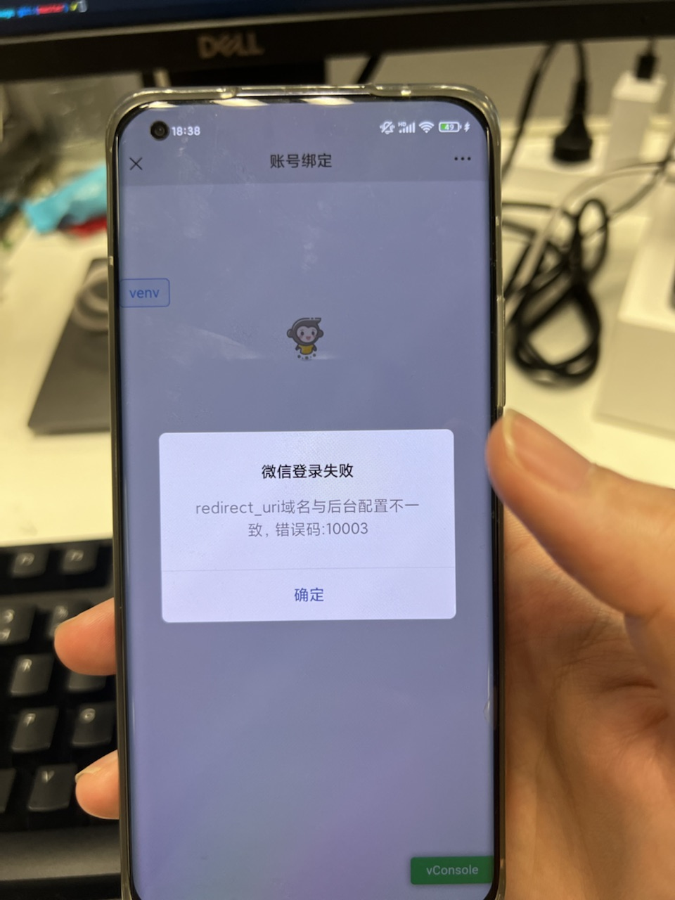

1. **整套流程梳理**：
    1.  midas -> 端内卡片配置 -> 小程序 -> 公众号 -> h5页面 -> 端内
    2.  在midas平台上进行配置，生成对应的客户端统跳信息，统跳上有参数origin

          ```
          leo://leo/miniprogram?username=gh_17f01738d8f5&path=%2Fpages%2Fwx-article%2Fwx-article%3Forigin%3Dkousuan_test
          ```
        username: 小程序原始ID
        path: /pages/wx-article/wx-article 小程序的路由，固定的，不可更改
        origin: midas上配置的key值，在小程序中需要根据origin来拉去midas中的数据

    3. 在小程序上开发pages/wx-article/wx-article页面
         1.  小程序的npm不能在控制台执行，要在开发者工具里边的 工具 -> 构建NPM 来执行，否则，就算运行了npm install，小程序运行还是会报错
         2.  小程序测试可以在开发者工具上上传代码，然后发布体验版测试
         3.  小程序中发送请求的url，需要在小程序后台配置，否则请求不通，此外，更改了request合法域名后，需要在开发者工具里边右上角 详情 -> 项目配置 -> 手动刷新

    4.  小程序页面根据origin参数，往midas发请求，拿到文章对应的url，在网页当中通过\<web-view\>来显示

          ```
          <view>
              <web-view src="{{article_url}}"></web-view>
          </view>
          ```

    5.  识别页面中的二维码跳转到对应的公众号，在点击关注时，微信会自动往公众号后台配置的接口发送一个请求，通知服务端关注事件，然后由服务端处理关注事件拿到对应的信息（取关也是相同操作），咱们这里是发送绑定模板
    6.  关注后进入公众号，服务端发送消息，内容带上我们的链接
    7.  通过链接进入我们的h5页面
        1.  [先授权，几个参数看一下](https://developers.weixin.qq.com/doc/offiaccount/OA_Web_Apps/Wechat_webpage_authorization.html)，发起授权请求时，微信会对授权链接做正则强匹配校验，如果链接的参数顺序不对，授权页面将无法正常访问
            1.  appid，公众号的id，根据这个判断redirect_uri该在哪个公众号配置
            2.  redirect_uri，打开微信之后跳转的网页
            3.  response_type
            4.  scope:
                1.  以snsapi_base为scope发起的网页授权，是用来获取进入页面的用户的openid的，并且是静默授权并自动跳转到回调页的。用户感知的就是直接进入了回调页（往往是业务页面）
                2.  以snsapi_userinfo为scope发起的网页授权，是用来获取用户的基本信息的。但这种授权需要用户手动同意，并且由于用户同意过，所以无须关注，就可在授权后获取该用户的基本信息。
            5.  state：重定向后会带上state参数，开发者可以填写a-zA-Z0-9的参数值，最多128字节
            6.  #wechat_redirect：无论直接打开还是做页面302重定向时候，必须带此参数
        2.  这次调用的是辅导那边的接口，参数有两个
            1.  authType：是主键id，值为kousuan_wechat1，是在辅导那边创建的值，对应一个业务ID，服务端根据authType去数据库里边拿业务id，值为111
            2.  mktUrl：我们自己页面的url
        3.  这个bug

            

            1. 是因为没有在公众号后台（不是小程序后台）配置网络授权域名
            2. [没有设置文件验证](https://support.huaweicloud.com/cloudsite_faq/cloudsite_faq_190917026.html)，[没有在该域名下的服务力的文件目录里上传文件](https://help.websitemanage.cn/index.php/show/612.html)

    8.  h5页面打开客户端形成闭环
2.  [微信打开app，跳转到对应页面](https://developers.weixin.qq.com/doc/offiaccount/OA_Web_Apps/Wechat_Open_Tag.html#%E8%B7%B3%E8%BD%ACAPP%EF%BC%9Awx-open-launch-app)
    1. import wx from 'weixin-js-sdk'，安装这个sdk
    2. [使用JS-SDK使用权限签名算法](https://developers.weixin.qq.com/doc/offiaccount/OA_Web_Apps/JS-SDK.html#62)，获取nonceStr和签名，这个公司封装好了方法直接调用就行
    3. 然后使用wx.config进行配置

            ```
            wx.config({
                debug: true, // 开启调试模式,调用的所有api的返回值会在客户端alert出来，若要查看传入的参数，可以在pc端打开，参数信息会通过log打出，仅在pc端时才会打印
                appId: '', // 必填，公众号的唯一标识
                timestamp: , // 必填，生成签名的时间戳
                nonceStr: '', // 必填，生成签名的随机串
                signature: '',// 必填，签名
                jsApiList: [], // 必填，需要使用的JS接口列表
                openTagList: [] // 可选，需要使用的开放标签列表，例如['wx-open-launch-app']
            });
            ```
    4.  配置完成之后就可以直接在html当中使用微信的模板

            ```
            <template>
                <wx-open-launch-app
                    id="launch-btn"
                    :appid="leoAppId"
                    :extinfo="getExtInfo()"
                    style="position: absolute; top: 0; left: 0; right: 0; bottom: 0; margin: auto; z-index: 20; overflow: hidden;"
                >
                    <script type="text/wxtag-template">
                    <style>
                        .btn {
                        width: 100%;
                        height: 100px;
                        position: absolute;
                        bottom: 0;
                        opacity: 0;
                        }
                    </style>
                    <button class="btn"></button>
                    </script>
                </wx-open-launch-app>
            </template>
            ```
        extinfo: 跳转所需额外信息，这里用到的是打开app后的统跳链接

3. [微信官方文档](https://developers.weixin.qq.com/doc/)
4. [微信h5页面支付流程](https://pay.weixin.qq.com/wiki/doc/api/H5.php?chapter=15_4)：

    

