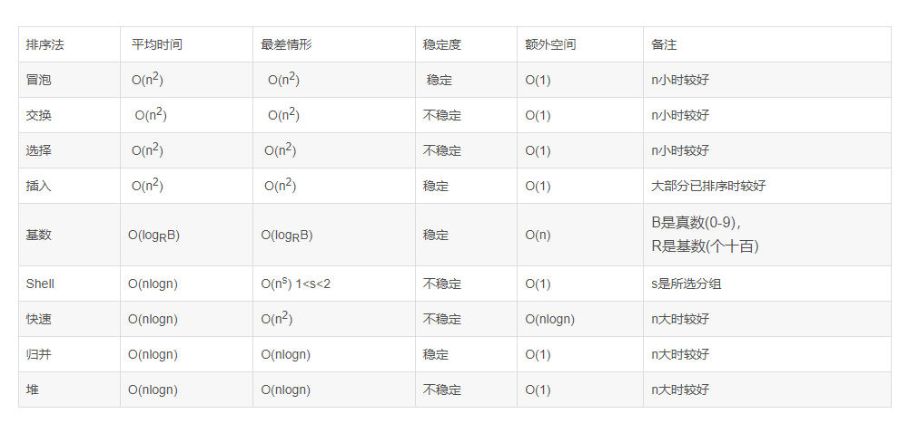

1. 动态规划：**核心在于拆分子问题，最核心的应该就是如何将dep[i]与dep[i-1]联系起来**
   1. 先分析有**几个影响因素**，来确定dep数组是几维数组
   2. 确定dep递推公式
   3. 确定初始值，将能初始化的值都初始化了，也可以根据递推公式确实哪些值需要初始化
   4. 从例子来简单确定dep
2. 排序算法
   1. **稳定算法：冒泡、插入、基数、归并**
   2. **不稳定算法：交换、选择、shell、快排、堆**
    

3. 贪心就是找最值，然后根据最值看看能不能找到全局最优的最值，尝试举反例，举不出来就尝试贪心，举出来了就动态规划