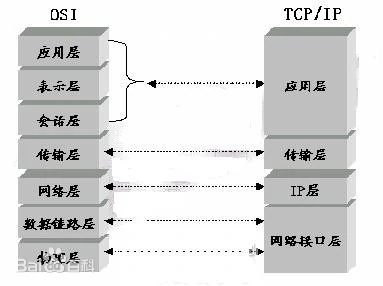

1. HTTP概述
    - URI、URL与URN
    - HTTP的几个版本
        + http 0.9
        + http 1.0
        + http 1.0+  keep-alive头部
        + http 1.1 用persistent 来取代 keep-alive

2. URL与资源
    - URL的语法：具体都代表什么含义

            <scheme>://<user>:<password>@<host>:<port>/<path>;<params>?<query>#<frag>

3. HTTP报文
    - 报文的组成：起始行、首部、主体
    - 请求报文与响应报文的格式
    - 请求的方法：
        + get、head
        + post、put
        + options
        + trace
        + delete
        + 幂等请求与非幂等请求：多次请求结果一样的请求方法就是幂等请求方法，例如get就是幂等请求，post是提交数据，他每次提交都有可能改变服务器上的数据，所以是非幂等的。**幂等与非幂等涉及到能否使用管道化连接，也算是他俩的区别吧**
    - 状态码：
        + 100 - 101
        + 200 - 206
        + 300 - 307
        + 400 - 417
        + 500 - 505
        + 301:永久重定向，第一次请求时，会发送请求，然后根据得到的location进行重定向，第二次则直接从浏览器的缓存中读取，不会再发送请求
        + 302:临时重定向，每次都会发送请求
    - 首部：
        + 通用首部
            * connection
            * update： 101的时候可能使用
            * date
            * 通用缓存首部：cache-control
        + 请求首部
            * Accept
                - Accept-Charset
                - Accept-Encoding
                - Accept-Language
            * Host
            * 条件请求首部：
                - Except： 100的时候可能使用
                - If-Match:如果实体标记与文档当前的实体标记相匹配，就获取这份文档
                - If-None-Match:如果提供的实体标记与当前文档的实体标记不相符，就获取文档
                - If-Modified-Since
                - If-Range:可能在416状态码使用，不清楚
            * 安全请求首部：
                - cookie
        + 响应首部：
        + 实体首部：
            * Allow：options请求时使用
            * Location：重定向里边用的多，其他也有
            * 内容首部：
                - Content-Base
                - Content-Encoding
                - Content-Language
                - Content-Length：与持久连接相关
                - Content-Location
                - Content-Type
            * 实体缓存首部：
                - ETag：用于协商缓存，对应请求首部里边的If-None-Match
                - Last-Modified：用于协商缓存，对应请求首部里边的If-Modified-Since
                - Expire: 用于强缓存，记录缓存有效的绝对时间

4. 连接管理
    - TCP慢启动：
        + TCP 连接会随着时间进行自我“调谐”，起初会限制连接的最大速度，如果数据成功传输，会随着时间的推移提高传输的速度。这种调谐被称为TCP慢启动（slow start），用于防止因特网的突然过载和拥塞。
        + TCP 慢启动限制了一个 TCP 端点在任意时刻可以传输的分组数。简单来说，每成功接收一个分组，发送端就有了发送另外两个分组的权限。如果某个HTTP事务有大量数据要发送，是不能一次将所有分组都发送出去的。必须发送一个分组，等待确认；然后可以发送两个分组，每个分组都必须被确认，这样就可以发送四个分组了，以此类推。这种方式被称为“打开拥塞窗口”。
    - 串行加载
    - 并行连接
    - 持久连接
        + 为了解决并行连接的缺点
            * 每个事务都会打开 / 关闭一条新的连接，会耗费时间和带宽。
            * 由于 TCP 慢启动特性的存在，每条新连接的性能都会有所降低。
            * 可打开的并行连接数量实际上是有限的。
        + 持久连接有两种类型：比较老的 HTTP/1.0+“keep-alive”连接，以及现代的 HTTP/1.1“persistent”连接。
        + Keep-Alive连接的限制和规则（看书）
        + Http 1.1 持久连接
            * 持久连接的限制和规则
    - 管道连接
        + 幂等性

5. 强缓存与协商缓存
    - 强缓存：Expire和Cache-Control
        + Expire：记录缓存的过期时间，绝对时间，可以通过修改系统时间来时它过期
        + Cache-Control：字段主要有三个
            * max-age：表示资源有效的最大秒数，是一个相对时间
            * public/private：public表示客户端和代理服务器（如CDN）都可以缓存，private（默认值）表示只有客户端可以缓存
            * no-store/no-cache：no-store是所有内容都不使用缓存，no-cache是只是用协商缓存
    - 协商缓存：主要两个字段
        + Last-Modified(Response)/If-Modified-Since(Request)：上次资源修改的时间，精确到1秒,
            * 缺点：
                - 1、从上图可以看到Last-Modified保存的是绝对时间，并且是精确到秒，所以如果资源在1秒内修改了多次的话，那就无法识别；
                - 2、对于文件只改变了修改时间，内容不变，这时候也会使缓存失效，其实这个时候我们是不希望客户端重新请求的；
                - 3、某些服务器不能精确的得到文件的最后修改时间；
        + ETag(Response)/If-None-Match(Request)：就是用来解决上述问题的，每次协商缓存，判断request中的If-None-Match与服务器中生成的ETag值是否相等，如果相等则证明缓存还可以使用
6. cookie字段信息
    -  cookie中的字段
        + name/value：在document.cookie = 'age = 15;'，此时name为age，value为15
        + Expires：过期时间
        + Secure：在安全的情况下才携带cookie，当请求是Https或者其他安全协议时，包含secure属性的cookie才会被发送到服务器，默认情况下，cookie是不会带secure选项的，所以默认情况下，http和https都会将cookie发送到服务器，但是一旦设置了secure选项，那么只能用https等安全协议
        + Domain/Path:设置cookie使用的域名和路径，只有在范围内的网址才能访问cookie。如果没设置的话则使用默认值，为生成cookie时所在的域名和路径
        + HttpOnly：带有httpOnly选项的cookie禁止js访问，可以用来防止xss攻击
        + [SameSite](https://juejin.cn/post/6844904095711494151) :SameSite 属性可以让 Cookie 在**跨站**请求时不会被发送，从而可以阻止跨站请求伪造攻击
          + Strict 仅允许一方请求携带 Cookie，即浏览器将只发送相同站点请求的 Cookie，即当前网页 URL 与请求目标 URL 完全一致。
          + Lax 允许部分第三方请求携带 Cookie
          + None 无论是否跨站都会发送 Cookie
          + 之前默认是 None 的，Chrome80 后默认是 Lax。
          + 在Chrome86版本开始，即使域名相同，但是协议不同也会作为跨站的判断因素，如果站点之间https协议和http协议混存，那么需要注意这个问题。
    - 如何设置cookie：
        + 服务端：在响应头里添加Set-Cookie:

                Set-Cookie: PA_SID=;Expire=Thu, 01-Jan-1970 00:00:00 GMT

        + 客户端：

                document.cookie = "age = 15 ; expires = Thu, 01-Jan-1970 00:00:00 GMT; Secure; httpOnly"
7. http 2.0
    - 二进制分帧
    - 多路复用：流和帧，帧中有标识，标记自己属于哪个流，流是有多个帧组成的数据流，一个流代表依次http请求，解决队头阻塞的问题
    - header压缩：对header中的内容进行压缩，并维护一个hash表，如果发送的header在hash表中，则发送对应的key值即可
    - 服务器push：服务器接收到请求后，主动push一些未来可能使用到的资源给客户端
8. http与https
    -  https = http + SSL\TLS
    - 私钥与公钥： 验证双方身份
    - 数字签名： 使用hash算法形成内容摘要，使用自己的私钥加密，然后对方使用公钥解密得到hash过后的摘要，然后使用约定好的hash算法来生成摘要，来判断内容是否被篡改
    - 证书： 自己制作或者通过第三方权威发放证书：
        - 自己制作：需要服务端确认
        - 权威发放的话，CA发放：无需确认
        - CA证书就是，服务器把自己的公钥发给CA，CA用自己的私钥加密，然后传回服务器，服务器发给客户端的时候，客户端用内置CA跟证书，然后解析服务器的公钥
    - 对称加密和非对称加密：获取对称加密密钥之前用非对称加密，确定对称密钥之后用对称加密，因为对称加密的速度要快，非对称要慢，所以建立连接之后使用对称加密
        - https三次握手的过程：第一次握手，客户端请求证书，第二次握手，服务器响应传回证书，第三次握手，客户端发送对称密钥给服务器

9. TCP三次握手四次挥手
10.  TCP和udp区别
11.  get和post区别
     1.   get发送一个包，post发送两个
     2.   get是幂等操作，post不是，所以get可以使用管道连接
     3.   get的参数对用户可见且长度收到url长度的限制，post不可见且长度不受限制
     4.   get后退刷新无害，post有害
12.  cookie、session、localStorage、sessionStorage
     1.   cookie与session
          1.   cookie:存放在**客户端**，存储格式为字符串，存储大小为不得超过4kb，安全性较低，一般用于存储用户的登录信息
          2.   session:存放在**服务端**，用session_id来进行区分，不同的用户有不同的seesion_id，一般用来在客户端存放用户的登录信息，也用来存储每个用户的**专有信息**，**例如购物车数据**等。当服务器收到需要创建一个session对象时，会判断cookie中的sessionID是否存在，如果存在，就**根据id返回对应的session对象**，如果不存在，就创建新的session对象，并返回对应的sessionID
          3.   session依赖于cookie，因为sessionID在cookie中携带，如果浏览器禁用cookie的话，需要重写url，将sessionID拼接到url当中
          4.   安全性：session的安全性大于cookie，因为sessionID包含在cookie当中，要想获取则需要先破解cookie，并且sessionID本身自己就是加密的。其次，sessionID只有在用户登录时，或者session_start启动时才有，所以破解了cookie也不一定能拿到sessionID。还有一点就是，第二次启动session_start时，上一次的sessionID就失效了，如果sessionID过期，sessionID也失效了，**此外sessionID是加密的**,所以session安全性好一点
          5.   优缺点：cookie最多可以携带的数据不能超过4kb，并且只能为字符串类型，而session则没有限制，它以类似于哈希表的方式储存，没有类型的限制。而且cookie每次访问都要携带，这样会浪费带宽。session因为存储数据没有限制，所以当用户数量过多，保存数据过多时，会被服务器的内存造成很大的压力，并且它依赖于cookie，如果cookie被禁，要重写url，不安全
     2. localStorage与sessionStorage：
        1. localStorage：存储在本地，除非用户手动删除否则永久存在
        2. sessionStorage：仅在当前会话下有效，如果网页关闭则失效
        3. 共同点：存储大小为5mb左右，不会随着请求传送到服务器
        4. **常用于长期登录（+判断用户是否已登录），适合长期保存在本地的数据。sessionStorage：敏感账号一次性登录；**
        5. setItem
        6. getItem
        7. removeItem
        8. clear
        9.  localStorage.length
13.  浏览器从输入url到页面加载的全过程
14.  DNS查询过程
15.  端口号问题：
     1.   因为我们只有一张网卡，网卡会有一个对应的ip地址，但是我们需要发送很多服务，所以就需要使用端口号。
     2.   任何一个需要网络通信的都需要端口号（包括微信、QQ等，只不过我们平常不注意也看不到，但是可以查到），http默认是80端口，https默认是443端口。
16.  dns递归过程
    

17. 网络结构
    1.  七层
        1.  应用层
            1.  网络服务与最终用户的一个接口。
            2.  协议有：HTTP FTP TFTP SMTP SNMP DNS TELNET HTTPS POP3 DHCP
        2.  表示层
            1.  数据的表示、安全、压缩。（在五层模型里面已经合并到了应用层）
            2.  格式有，JPEG、ASCll、EBCDIC、加密格式等 [2]
        3.  会话层
            1.  建立、管理、终止会话。（在五层模型里面已经合并到了应用层）
            2.  对应主机进程，指本地主机与远程主机正在进行的会话
        4.  传输层
            1.  定义传输数据的协议端口号，以及流控和差错校验。
            2.  协议有：TCP UDP，数据包一旦离开网卡即进入网络传输层
        5.  网络层
            1.  进行逻辑地址寻址，实现不同网络之间的路径选择。
            2.  协议有：ICMP IGMP IP（IPV4 IPV6）
        6.  数据链路层
            1.  建立逻辑连接、进行硬件地址寻址、差错校验 [3]  等功能。（由底层网络定义协议）
            2.  将比特组合成字节进而组合成帧，用MAC地址访问介质，错误发现但不能纠正。
        7.  物理层
            1.  建立、维护、断开物理连接。（由底层网络定义协议
    2.  四层网络结构
        1.  应用层
        2.  传输层
        3.  ip层
        4.  网络接口层
    3.  对比
        
18. Cookie：当**服务器收到** HTTP 请求时，服务器可以**在响应头里面添加**一个 Set-Cookie 选项。浏览器**收到响应后通常会保存下 Cookie**，之后对该服务器每一次请求中都通过 Cookie 请求头部将 Cookie 信息发送给服务器。过期时间有Expire和max-age来决定
