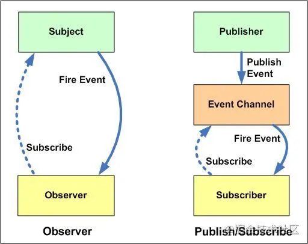

1. [开放封闭原则（OCP原则）](https://www.cnblogs.com/gaochundong/p/open_closed_principle.html)：软件实体（类、模块、函数等）应对扩展开放，但对修改封闭。[JS相关](https://blog.csdn.net/weixin_33830216/article/details/87996215)
2. 单一职责原则：就一个类而言，引起它变化的原因应该只有一个。在两个职责耦合到一起时，一个职责的变化可能会影响到另外一个职责，这就是单一职责的必要性。不过有时候也不需要过分追求，如果两个职责总是同时发生改变的，就没有必要进行拆分
3. 最少知识原则：在程序设计时，应尽量减少对象之间的交互。
4. 单例模式：保证一个类仅有一个实例，并提供一个访问它的全局访问点。简单来说就是在获取实例的方法里边，先判断该实例是否存在，不存在的话则创建实例，存在的话则返回当前实例

    ```
    两种方法
    不使用闭包
    function Single(name) {
      this.name = name
    }

    Single.instance = null
    Single.getInstance = function(name) {
      if(!this.instance) {
        this.instance = new Single(name)
      }
      return this.instance
    }

    使用闭包
    function Single(name) {
      this.name = name
    }

    Single.getInstance = (function() {
      var instance = null
      return function(name) {
        if(!instance) {
        instance = new Single(name)
      }
      return instance
      }
    })()
    ```

5. [策略模式](https://segmentfault.com/a/1190000017721211)
   1. 个人理解就是：使用hook来代替if-else

      ```
      **if-else**

      var calculateBonus = function( performanceLevel, salary ){
          if ( performanceLevel === 'S' ){
              return salary * 4;
          }
          if ( performanceLevel === 'A' ){
              return salary * 3;
          }
          if ( performanceLevel === 'B' ){
              return salary * 2;
          }
      };

      calculateBonus( 'B', 20000 ); // 输出：40000
      calculateBonus( 'S', 6000 ); // 输出：24000


      **hook**

      var strategies = {
          "S": function( salary ){
              return salary * 4;
          },
          "A": function( salary ){
              return salary * 3;
          },
          "B": function( salary ){
              return salary * 2;

          }
      };
      var calculateBonus = function( level, salary ){
          return strategies[ level ]( salary );
      };

      console.log( calculateBonus( 'S', 20000 ) ); // 输出：80000
      console.log( calculateBonus( 'A', 10000 ) ); // 输出：30000
      ```

  1. 何时使用：
     1. 各判断条件下的策略相互独立且可复用
     2. 策略内部逻辑相对复杂
     3. 策略需要灵活组合
6. 观察者模式
   1.  定义：在软件设计中是一个对象，维护一个依赖列表，当任何状态发生改变自动通知它们。
7. [发布订阅模式](https://juejin.cn/post/6844903616172539917)
   1. 定义：说到发布订阅模式，它其实是一种对象间一对多的依赖关系，当一个对象的状态发送改变时，所有依赖于它的对象都将得到状态改变的通知
   2. 作用
      1. 广泛应用于异步编程中(替代了传递回调函数)
      2. 对象之间松散耦合的编写代码
   3. 实现
      1. 定义一个订阅中心
      2. 订阅中心有三个函数，on，emit，remove
      3. on函数，根据不同的事件，定义不同的事件队列，队列里边保存了所有订阅该事件的订阅者要执行的动作
      4. emit函数，发布者发布信号的函数，发布这个信号时，检查对应的事件队列中是否有订阅者，没有的话直接返回，有的话，根据发布者发出的参数，forEach执行订阅者队列里边的订阅者收到信号后要执行的函数
      5. remove函数，找到对应的事件的订阅者队列，根据要删除的订阅者名字删除订阅队列里边的订阅者
   4. 发布订阅模式与观察者模式的区别
      1. 发布订阅模式，发布者的消息通过订阅中心发送给订阅者，发布者和订阅者彼此不知道对方的存在，订阅者只根据订阅中心的信号来做操作，**换句话说，发布-订阅模式用来处理不同系统组件的信息交流，即使这些组件不知道对方的存在。**
      2. 而观察者模式是直接发送给订阅者
      3. 在观察者模式中，观察者是知道Subject的，Subject一直保持对观察者进行记录。然而，在发布订阅模式中，发布者和订阅者不知道对方的存在。它们只有通过消息代理进行通信。
      4. 在**发布订阅模式**中，**组件是松散耦合的**，正好和观察者模式相反。
      5. **观察者模式**大多数时候是**同步**的，比如当事件触发，Subject就会去调用观察者的方法。而**发布-订阅模式**大多数时候是**异步的**（使用消息队列）。
      6. 观察者模式需要在单个应用程序地址空间中实现，而发布-订阅更像交叉应用模式。

      

   5. 何时使用
      1. 各模块相互独立
      2. 存在一对多的依赖关系
      3. 依赖模块不稳定、依赖关系不稳定
      4. 各模块由不同的人员、团队开发
8. 装饰器模式：给一个函数赋能，增强它的某种能力，并不会对原有的能力有任何影响
   1. 原理就是，JS万物皆对象，将函数最为参数传给另外一个函数，来实现对原来函数能力的增强
9. 适配器模式：这是一个相对比较简单的设计模式，初衷其实就是，两个软件之间的接口不互通时，需要写一个类似于现实生活中“转换器”一样的东西来使得两个接口统一，距离，普通U盘只能使用USB与电脑连接，但是我的电脑只有type-c，这时候我就需要一个USB转type-c转换器，U盘只需要与转换器打交道，而不是直接与电脑打交道，开发中类似，我们有一个接口，已经定义好了数据接口，但是新来的数据不符合这个数据结构，这时候我们就需要使用适配器模式，让新来的数据与适配器打交道，来生成符合我们接口的数据。
10. 代理模式：当直接访问一个对象不方便时，则使用代理来访问该对象，最简单的例子，我们直接访问Goole不行，所以使用小飞机来访问Google
   1. 保护代理：个人理解，是用来帮助被访问对象的，书中的例子，一个妹子找男朋友，告诉他的朋友，她有什么样的要求，不符合要求的让朋友直接拒绝，这个妹子的朋友就是代理，保护代理
   2. 虚拟代理：个人理解，是帮助请求方的，一个男生追妹子，找到了共同的好友b，b知道什么时候送花成功率大，这时候a就让b观察妹子，妹子心情好时，b就帮a买花送给妹子，这个就是虚拟代理
   3. JS不容易实现保护代理，因为我们无法判断是谁访问了这个对象，所以虚拟代理是最常用的代理模式
   4. 好处：
      1. 现在我们的需求需要使用代理，但是以后万一不用了，我们只需要删除代理即可，而不需要删除原有的代码，very好用
   5. **个人理解：** 感觉核心思想就是
      1. 当直接访问对象不方便时，我们需要使用代理来访问
      2. 使用代理来对访问进行处理，统一处理后再访问对象，有点像拦截器的作用。
   6. 何时使用
      1. 模块职责单一且可复用
      2. 两个模块间的交互需要一定限制关系
11. 责任链模式：避免请求发送者与接收者耦合在一起，让多个对象都有可能接收请求，将这些对象连接成一条链，并且沿着这条链传递请求，直到有对象处理它为止。
   7. 个人理解：将回调地狱改成链式调用

      ```
      function A() {
        B()
      }

      function B() {
        C()
      }

      function C() {
        end
      }

      改成

      function A() {}
      function B() {}
      function C() {}

      function chain(fn) {
        this.fn = fn;
        this.setNext = function() {}
        this.run = function() {}
      }

      const chainA = new Chain(A);
      const chainB = new Chain(B);
      const chainC = new Chain(C);
      chainA.setNext(chainB).setNext(chainC);
      chainA.run();
      ```
    这样就可以根据不同的情况，动态的增加或者删除条件

  2. 何时使用
     1. 你负责的是一个完整流程，或你只负责流程中的某个环节
     2. 各环节可复用
     3. 各环节有一定的执行顺序
     4. 各环节可重组